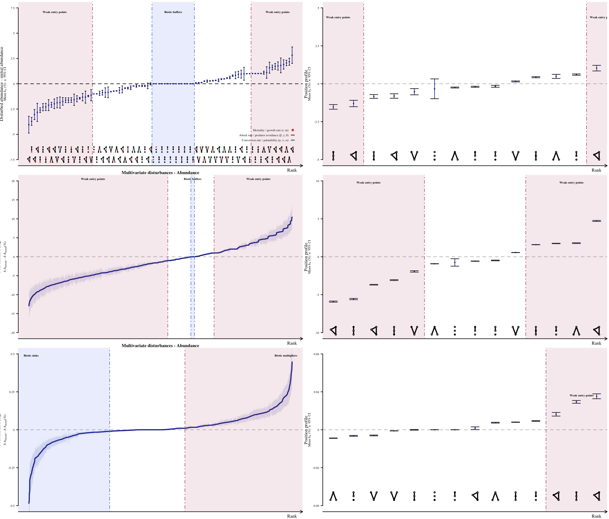
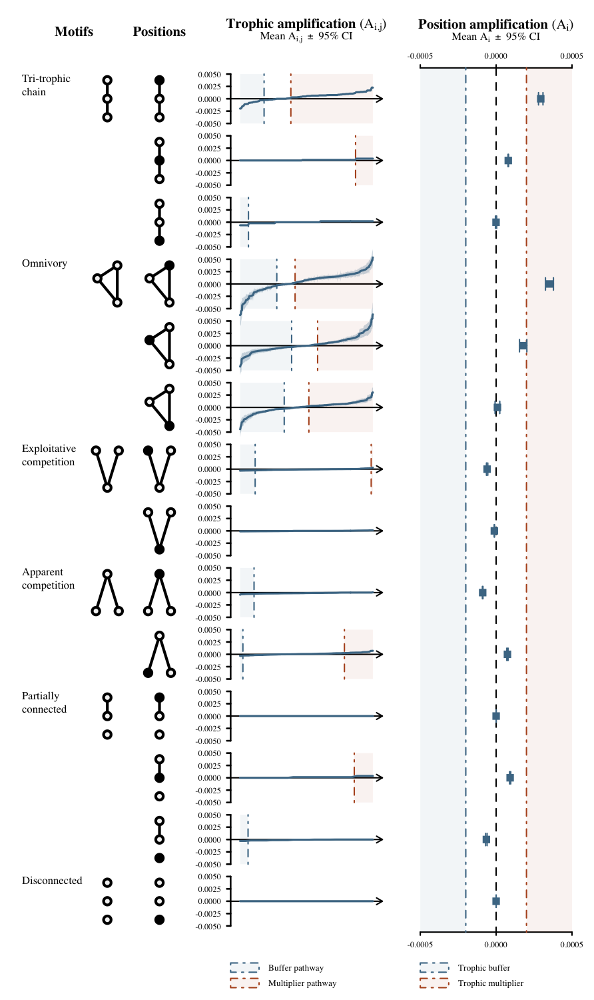

<!--
rmarkdown::render('./FoodWebs-MultipleStressors.md', 'pdf_document')
-->

# Introduction

Global changes are resulting in increasingly intricate environmental stress
exposure regimes [@halpern2015a; @bowler2019]. Exposure to multiple interacting
stressors can induce complex and unpredictable environmental effects that can
propagate through entire ecological communities by way of biotic interactions
[@bascompte2009a; @montoya2009].

Pathways of effect

Literature on the effects of disturbances on the structure of empirical and simulated networks

Recent attempts have focused on

In this paper, we investigated

There is a rich literature documenting the effects of disturbances on communities
and how network structure contributes to community resistance [@refs].
It however remains unclear how network structure influences community resistance
to multiple disturbances.
Recent efforts have focused on [...]. [@thompson2018; @galic2018; @schafer2018] <!-- document -->
Here, we seek to identify what characteristics of network structure
and the role of species in buffering against or multiplying the effects of
multiple stressors.

# Objectives

Our goal was to investigate the impact of disturbances targetting multiple
pathways of effect (*e.g.* mortality and physiology) on the

The overarching goal is to conceptualize how the structure of food webs affects
the direct and indirect propagation of multiple sources of stress non-linearly
and affects the likelihood of observing antagonistic or synergistic effects of
multiple stressors.
The objectives are to 1) identify network characteristics
that make them more or less sensitive or resistant to multiple stressors and 2)
what is the role of species and their interactions contributing to the
propensity of networks in buffering against or amplifying the effects of multiple
stressors.

# Methodology

## Models

The dynamics of the four most abundant 3-species motifs (*i.e.* tri-trophic
food chain, omnivory, exploitative and apparent competition) in empirical food
webs [@stouffer2010] were modeled using Lotka-Voltera equation systems solved at
equilibrium. We also included two additional motifs [...]

Resources were modeled using logistic growth equations of the form
$\frac{dX_i}{dt} = X_i(r_i - \alpha_{ii} X_i - \sum \alpha_{ij} X_j)$,
where $X$ are species, $i$ is the resource, $j$ are the consumers, $r_i$ is the
intrinsic resource growth rate, $\alpha_{ii}$ is the density-dependent effect of
the resource on itself and $\alpha_{ij}$ is the rate at which consumer $j$
affects resource $i$, i.e. the attack rate.

Consumers and predators were modeled with a Type I functional response of the form
$\frac{dX_j}{dt} = X_j(-m_j + \sum e_{ij} \alpha_{ij} X_i - \alpha_{jk} X_k)$,
where $m$ is the mortality rate and $e$ is the rate at which resource biomass is
transformed into consumer biomass, *i.e.* the conversion rate. $e$ is a scaling
parameter of the attack rate which cannot exceed 1, since 1 unit of resource
biomass cannot be transformed into more than 1 unit of consumer biomass.

As no equilibrium exists for the exploitative competition motif with
Lotka-Voltera models of these forms, competitive parameters of the form
$\alpha_{jj} \alpha_{jk} X_j X_k - \alpha_{jj} X_j^2$ were included in the
consumer models to constrain their growth and obtain solutions at equilibrium.
Sage [@ref] was used to solve all equation systems at equilibrium. All other
analyses were performed using R [@ref]. All code and data used to perform the
simulations and analyses are available at [...].

Initial parameter values were set by using a simulated annealing algorithm
optimizing for consumer and predator abundance.

Model parameter values for intrinsic growth and
resource density-dependence parameters were fixed to 1 and 0.001, respectively,
to bound all solutions. Competitive parameters for the exploitative competition motif
were also fixed at 0.001 since those parameters were not to be investigated in
our analyses. Conversion rates were fixed to 0.5. Finally, a total of 100 sets
of mortality and attack rates were evaluated using a simulated annealing
algorithm optimizing for consumer abundance.  

## Initial parameter values

## Disturbances

\newpage

# Results

## Univariate disturbances

## Multivariate disturbances

## Additivity

\newpage

# Supplementary Material

## Models

\begin{table}[H]
\centering
\renewcommand{\arraystretch}{1.25}
\begin{tabular}{p{12.67ex} | l | l}
\hline
\textbf{Motifs} & \textbf{Equation systems} & \textbf{Parameters} \\[0.5ex]
\hline\hline
% ------------------------------------------------
Tri-trophic food chain &
$\begin{array} {lcl}
  \frac{dX_i}{dt} &=& X_i(r_i - \alpha_{ii} X_i - \alpha_{ij} X_j) \\
  \frac{dX_j}{dt} &=& X_j(e_{ij} \alpha_{ij} X_i - \alpha_{jk} X_k - m_j) \\
  \frac{dX_k}{dt} &=& X_k(e_{jk} \alpha_{jk} X_j - m_k)
\end{array}$ &
$\begin{array} {lcl}
  r_i = 1 \\
  \alpha_{ii} = 0.001 \\
  \alpha_{ij}, \alpha_{jk} \in [0.0001, 0.01] \\
  e_{ij}, e_{jk} = 0.5 \\
  m_j, m_k \in [0.01, 0.5]
\end{array}$ \\
\hline
% ------------------------------------------------
Omnivory &
$\begin{array} {lcl}
  \frac{dX_i}{dt} &=& X_i(r_i - \alpha_{ii} - \alpha_{ij} X_j - \alpha_{ik} X_k) \\
  \frac{dX_j}{dt} &=& X_j(e_{ij} \alpha_{ij} X_i - \alpha_{jk} X_k - m_j) \\
  \frac{dX_k}{dt} &=& X_k(e_{ik} \alpha_{ik} X_i + e_{jk} \alpha_{jk} X_j - m_k) \\
\end{array}$ &
$\begin{array} {lcl}
  r_i = 1 \\
  \alpha_{ii} = 0.001 \\
  \alpha_{ij}, \alpha_{ik}, \alpha_{jk} \in [0.0001, 0.01] \\
  e_{ij}, e_{ik}, e_{jk} = 0.5 \\
  m_j, m_k \in [0.01, 0.5]
\end{array}$ \\
\hline
% ------------------------------------------------
Exploitative competition &
$\begin{array} {lcl}
  \frac{dX_i}{dt} &=& X_i(r_i - \alpha_{ii} - \alpha_{ij} X_j - \alpha_{ik} X_k) \\
  \frac{dX_j}{dt} &=& X_j(e_{ij} \alpha_{ij} X_i - \alpha_{jj}\alpha_{jk}X_k - \alpha_{jj}X_j - m_j) \\
  \frac{dX_k}{dt} &=& X_k(e_{ik} \alpha_{ik} X_i - \alpha_{kk}\alpha_{kj}X_j - \alpha_{kk}X_k - m_k) \\
  \end{array}$ &
  $\begin{array} {lcl}
    r_i = 1 \\
    \alpha_{ii}, \alpha_{jj}, \alpha_{kk}, \alpha_{jk}, \alpha_{kj} = 0.001 \\
    \alpha_{ij}, \alpha_{ik}, \in [0.0001, 0.01] \\
    e_{ij}, e_{ik} = 0.5 \\
    m_j, m_k \in [0.01, 0.5]
  \end{array}$ \\
\hline
% ------------------------------------------------
Apparent competition &
$\begin{array} {lcl}
  \frac{dX_i}{dt} &=& X_i(r_i - \alpha_{ii} X_i - \alpha_{ik} X_k) \\
  \frac{dX_j}{dt} &=& X_j(r_j - \alpha_{jj} X_j - \alpha_{jk} X_k) \\
  \frac{dX_k}{dt} &=& X_k(e_{ik} \alpha_{ik} X_i + e_{jk} \alpha_{jk} X_j - m_k)
  \end{array}$ &
  $\begin{array} {lcl}
    r_i, r_j = 1 \\
    \alpha_{ii}, \alpha_{jj} = 0.001 \\
    \alpha_{ik}, \alpha_{jk} \in [0.0001, 0.01] \\
    e_{ik}, e_{jk} = 0.5 \\
    m_k \in [0.01, 0.5]
  \end{array}$ \\
\hline
% ------------------------------------------------
Partially disconnected &
$\begin{array} {lcl}
  \frac{dX_i}{dt} &=& X_i(r_i - \alpha_{ii} X_i - \alpha_{ik} X_k) \\
  \frac{dX_j}{dt} &=& X_j(r_j - \alpha_{jj} X_j) \\
  \frac{dX_k}{dt} &=& X_k(e_{ik} \alpha_{ik} X_i - m_k)
  \end{array}$ &
  $\begin{array} {lcl}
    r_i, r_j = 1 \\
    \alpha_{ii}, \alpha_{jj} = 0.001 \\
    \alpha_{ik} \in [0.0001, 0.01] \\
    e_{ik} = 0.5 \\
    m_k \in [0.01, 0.5]
  \end{array}$ \\
\hline
% ------------------------------------------------
Disconnected &
$\begin{array} {lcl}
  \frac{dX_i}{dt} &=& X_i(r_i - \alpha_{ii} X_i) \\
  \frac{dX_j}{dt} &=& X_j(r_j - \alpha_{jj} X_j) \\
  \frac{dX_k}{dt} &=& X_k(r_k - \alpha_{kk} X_k)
  \end{array}$ &
  $\begin{array} {lcl}
    r_i, r_j, r_k = 1 \\
    \alpha_{ii}, \alpha_{jj}, \alpha_{kk} = 0.001 \\
  \end{array}$ \\
\hline
\end{tabular}
\caption{Systems of Lotka-Volterra equations used to model the effect of multiple disturbances}
\label{equations}
\end{table}

\newpage

<!--

#### Analytical simulations

We now explore the parameter space by varying parameters on all possible
combinations to simulate disturbances. For the simulations, we assume that
disturbances are always negative, *e.g.* causing a decrease in predator attack
rate or an increase in mortality. Parameter variations are randomly drawn
from a uniform distribution within a 40% parameter range from the default
value.

***I believe that this should eventually be modified to explore the parameter
space so that we explore the full range of parameters that ensures species
co-existance and evaluate which parameters are more robust to modifications.
For now, though, I set this to 40% because it allows me to
better explore the disturbances that are dominant. For example, certain
parameters have no effect on the abundance of certain species.***

Analytical abundance results for each species are then compared to those
using the default parameters to evaluate the percent change in abundance.
To compare whether disturbances are additive or non-additive, we then
compare the additive model, *i.e.* the sum of the individual parameter
changes, with the joint models, *i.e.* parameters changed simultaneously.
Comparisons are performed by substracting the percent abundance change of the
joint model with that of the additive model. A null difference signifies either
an absence of effect, an additive effect or a dominant effect. A negative
difference means a greater difference from the additive model than the joint
model, hence an antagonistic effect for the joint model, while a positive
difference is the inverse, *i.e.* a synergistic effect for the joint model.
Results are presented as a series of boxplot as an initial
exploratory analysis.
-->

\newpage

# Introduction

Global changes, <!-- be they natural or human-induced -->, are resulting in increasingly
intricate environmental stress exposure regimes [@halpern2015a; @bowler2019].
Exposure to multiple interacting stressors can induce complex and unpredictable
environmental effects that can propagate through entire ecological communities
by way of interactions linking species together [@refs].

<!-- This may be irrelevant in the introduction, depending on where we end up submitting -->
Net effects of multiple stressors can be
additive (*i.e.* joint effect equal to the sum of individual effects),
synergistic (joint effect superior to the sum of individual effects),
antagonistic (joint effect inferior to the sum of individual effects) or
dominant (joint effect equal to an individual effect)
[e.g. @crain2008; @darling2008; @cote2016].

There is a rich literature documenting the effects of disturbances on communities
and how network structure contributes to community resistance [@refs].
It however remains unclear how network structure influences community resistance
to multiple disturbances.
Recent efforts have focused on [...]. [@thompson2018; @galic2018; @schafer2018] <!-- document -->
Here, we seek to identify what characteristics of network structure
and the role of species in buffering against or multiplying the effects of
multiple stressors.

<!-- Maybe in the introduction talk about the modelling approaches that have been creeping up in the literature recently
  - thompson2018
  - galic2018
  - delaender2018

  Check these authors recent work
 -->

# Objectives

The overarching goal is to conceptualize how the structure of food webs affects
the direct and indirect propagation of multiple sources of stress non-linearly
and affects the likelihood of observing antagonistic or synergistic effects of
multiple stressors.
The objectives are to 1) identify network characteristics
that make them more or less sensitive or resistant to multiple stressors and 2)
what is the role of species and their interactions contributing to the
propensity of networks in buffering against or amplifying the effects of multiple
stressors.

# Non-linear effects

Let's begin by conceptualizing the effects of 2 environmental stressors on a
simple 3-species omnivory food web (Figure \ref{omniEx}). For our exercise, we are
not truly interested in the identify of the sources of stress. We rather focus
on the resulting disturbance on species themselves. This means that we will not
investigate the effects of multiple stressors applied to a single species in the
food web. This precludes us from investigating the sensitivity of species to
each individual stressor. Rather, we investigate the effects of disturbances to
multiple species simultaneously. But see @thompson2018a and @thompson2018 for
a description of a modelling approaching incorporating multiple sources of
stress in a food web.

# Pathways of multiple effects in motifs

A food web can be decomposed into a sets of smaller $n$-species subgraphs called
motifs [@milo2004; @stouffer2007].
For example, there are 13 distinct 3-species motifs composed of 30 unique
positions [Figure \ref{stouffer}; @stouffer2007; @stouffer2012].
These motifs form the backbone of food web and their over- or
under-representation in food webs can provide valuable insights into community
dynamics.
Motifs have been used to investigate the persistence of food web to species
extinctions [@stouffer2010] and the benefit associated to each species in food
web persistence [@stouffer2012].

Here, we use 3-species motifs to investigate whether multiple disturbances
applied to different motifs are more or less likely to result in non-linear
effects.

We focus on the four most frequent motifs found in food webs, *i.e.* tri-trophic
chains, omnivory, exploitative competition and apparent competition
[Figure \ref{path}; @camacho2007; @stouffer2010].
Two additional motifs, *i.e.* partially connected and disconnected were also
considered in order to evaluate whether interactions in food webs are truly more
likely to be characterized by non-linear effects (Figure \ref{path}).

<!-- This results in 6 distinct motifs, 14 different positions and 74 distinct
pathways of effect (Figure \ref{path}).
There are 34 single pathways of effects, of which 14 are direct and 20 are
strictly indirect.
There are also 10 strictly indirect (*i.e.*
only peripheral species disturbed) double pathways of effect, and 21 double and
10 triple pathways of effects with both direct and indirect effects (*i.e.*
involving focal and peripheral species; Figure \ref{path}). -->

\newpage

# Equation systems

Using lotka-volterra predator-prey equations with resource logistic growth, we
evaluate analytically the effects of multiple disturbances on species contained
in the different motifs considered. The parameters considered are the following.

| Parameters    | Description                                         | Units           |
| :-----------: | :-------------------------------------------------- | --------------- |
| $x$           | Species x abundance                                 | $n$             |
| $y$           | Species y abundance                                 | $n$             |
| $z$           | Species z abundance                                 | $n$             |
| $r$           | Growth rates                                        | $1/t$           |
| $m$           | Mortality rates                                     | $1/t$           |
| $\alpha_{ii}$ | Density dependent effect of species i on itself     | $1/At$          |
| $\alpha_{ij}$ | Effect species j on species i                       | $1/At$          |

The effects $\alpha$ of species on each other can be further defined as being
attack and conversion rates. The conversion rates are equal to a scaling
parameters ($\mu, \nu, \omega$) multiplied by the attack rate and the conversion
rate cannot exceed the attack rate, so that the scaling parameters is < 1.
Hence, the full set of parameters used for the motif models is:

| Parameters    | Description                                         | Units           |
| :-----------: | :-------------------------------------------------- | --------------- |
| $x$           | Species x abundance                                 | $n$             |
| $y$           | Species y abundance                                 | $n$             |
| $z$           | Species z abundance                                 | $n$             |
| $r_x$         | Growth rates                                        | $1/t$           |
| $r_y$         | Growth rates                                        | $1/t$           |
| $r_z$         | Growth rates                                        | $1/t$           |
| $m_y$         | Mortality rates                                     | $1/t$           |
| $m_z$         | Mortality rates                                     | $1/t$           |
| $\alpha_x$    | Density dependent effect of $i$ on itself           | $1/At$          |
| $\alpha_y$    | Density dependent effect of $y$ on itself           | $1/At$          |
| $\alpha_z$    | Density dependent effect of $z$ on itself           | $1/At$          |
| $\beta$       | Attack rate of $y$ on $x$                           | $1/At$          |
| $\delta$      | Attack rate of $z$ on $y$                           | $1/At$          |
| $\gamma$      | Attack rate of $z$ on $x$                           | $1/At$          |
| $\mu$         | Scaling parameter for conversion rate $y$ on $x$    | $1/At$          |
| $\nu$         | Scaling parameter for conversion rate $z$ on $x$    | $1/At$          |
| $\omega$      | Scaling parameter for conversion rate $z$ on $y$    | $1/At$          |

The subscript identifying species for growth rates ($r$), density-dependence
effects ($\alpha$) and mortality rates ($m$) is not used in motifs where the
parameter exists for a single species.

\newpage

# Next points

- Non-linear effects in motifs
- Species contribution to non-linear effects
- Species profiles (frequency of times occupying roles that contribute to non-linear effects; see @stouffer2012)
- Graphs to present these results
- Methods

# Interesting points

- Effect limit [@schafer2018]: maximum effect size for a response (*e.g.* 100% mortality, zero growth or reproduction)

# Literature to cite - or at least look at!

- @adams2005
- @brown2013
- @brown2014
- @christensen2006
- @crain2008
- @darling2013
- @folt1999
- @galic2018 *
- @jackson2016
- @kath2018
- @lange2018
- @piggott2015
- @schafer2018 *
- @segner2014
- @thompson2018
- @thompson2018a
- @vinebrooke2004

\newpage

# References
 -->

<!--
Complex
interactions between co-occurring stressors remains the largest uncertainty
in predicting impacts to natural systems [@darling2008; @cote2016], yet most
assessments still overwhelmingly focus on single stressors [@obrien2019].

-->

<!--
## Tri-trophic chain

\begin{eqnarray}
  \nonumber \frac{dx}{dt} &=& x(r - \alpha x - \beta y) \\
  \nonumber \frac{dy}{dt} &=& y(\mu \beta x - \delta z - m_y) \\
  \nonumber \frac{dz}{dt} &=& z(\omega \delta y - m_z) \\
\end{eqnarray}

## Omnivory

\begin{eqnarray}
  \nonumber \frac{dx}{dt} &=& x(r - \alpha x - \beta y - \gamma z) \\
  \nonumber \frac{dy}{dt} &=& y(\mu \beta x - \delta z - m_y) \\
  \nonumber \frac{dz}{dt} &=& z(\nu \gamma x + \omega \delta y - m_z) \\
\end{eqnarray}

## Exploitative competition

\begin{eqnarray}
  \nonumber \frac{dx}{dt} &=& -{\left(\mathit{\alpha_{xx}} x + b y + g z - r\right)} x \\
  \nonumber \frac{dy}{dt} &=& {\left(b u x - \mathit{ajj} \mathit{ajk} z - \mathit{ajj} y - \mathit{my}\right)} y \\
  \nonumber \frac{dz}{dt} &=& {\left(g v x - \mathit{akj} \mathit{akk} y - \mathit{akk} z - \mathit{mz}\right)} z \\
\end{eqnarray}

## Apparent competition

\begin{eqnarray}
  \nonumber \frac{dx}{dt} &=& x(r_x - \alpha_x x - \gamma z) \\
  \nonumber \frac{dy}{dt} &=& y(r_y - \alpha_y y - \delta z) \\
  \nonumber \frac{dz}{dt} &=& z(\nu \gamma x + \omega \delta y - m_z) \\
\end{eqnarray}

## Partially disconnected

\begin{eqnarray}
  \nonumber \frac{dx}{dt} &=& x(r_x - \alpha_x x - \beta y) \\
  \nonumber \frac{dy}{dt} &=& y(\mu \beta x - m_y) \\
  \nonumber \frac{dz}{dt} &=& z(r_z - \alpha_z z) \\
\end{eqnarray}

## Disconnected

\begin{eqnarray}
  \nonumber \frac{dx}{dt} &=& x(r_x - \alpha_x x) \\
  \nonumber \frac{dy}{dt} &=& y(r_y - \alpha_y y) \\
  \nonumber \frac{dz}{dt} &=& z(r_z - \alpha_z z) \\
\end{eqnarray}
-->
