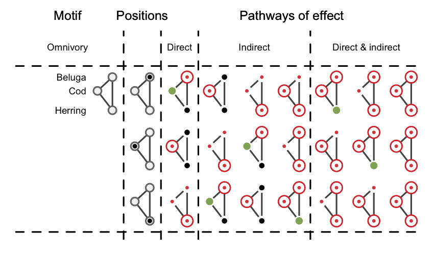

<!--
rmarkdown::render('./FoodWebs-MultipleStressors.md', 'pdf_document')
-->

<!--
https://www.symbolab.com/solver/derivative-calculator/
https://mccannlab.org/aboutDE/mathematical-prerequisites.html
-->

# Introduction

Global changes, be they natural or human-induced, are resulting in increasingly
intricate environmental stress exposure regimes [@halpern2015a; @bowler2019].
Exposure to multiple interacting stressors can induce complex and unpredictable
environmental effects that can propagate through entire ecological communities
by way of interactions linking species together [@refs].
Net effects of multiple stressors can be
additive (*i.e.* joint effect equal to the sum of individual effects),
synergistic (joint effect superior to the sum of individual effects),
antagonistic (joint effect inferior to the sum of individual effects) or
dominant (joint effect equal to an individual effect)
[e.g. @crain2008; @darling2008; @cote2016].
There is a rich literature documenting the effects of disturbances on communities
and how network structure contributes to community resistance [@refs].
It however remains unclear how network structure influences community resistance
to multiple disturbances.
Recent efforts have focused on [...]. [@thompson2018; @galic2018; @schafer2018] <!-- document -->
Here, we seek to identify what characteristics of network structure
and the role of species in buffering against or multiplying the effects of
multiple stressors.

# Objectives

The overarching goal is to conceptualize how the structure of food webs affects
the direct and indirect propagation of multiple sources of stress non-linearly
and affects the likelihood of observing antagonistic or synergistic effects of
multiple stressors.
The objectives are to 1) identify network characteristics
that make them more or less sensitive or resistant to multiple stressors and 2)
what is the role of species and their interactions contributing to the
propensity of networks in buffering against or amplifying the effects of multiple
stressors.

# Non-linear effects

Let's begin by conceptualizing the effects of 2 environmental stressors on a
simple 3-species omnivory food web (Figure \ref{omni}). For our exercise, we are
not truly interested in the identify of the sources of stress. We rather focus
on the resulting disturbance on species themselves. This means that we will not
investigate the effects of multiple stressors applied to a single species in the
food web. This precludes us from investigating the sensitivity of species to
each individual stressor. Rather, we investigate the effects of disturbances to
multiple species simultaneously. But see @thompson2018a and @thompson2018 for
a description of a modelling approaching incorporating multiple sources of
stress in a food web.

By investigating the effects of multiple disturbances on multiple species, there
are essentially 7 distinct pathways of effects in the 3-species system:

| Pathways of effect |
|:-----------------: |
|$D_i$               |
|$D_j$               |
|$D_k$               |
|$D_{i,j}$           |
|$D_{i,k}$           |
|$D_{j,k}$           |
|$D_{i,j,k}$         |

$D$ denotes a disturbance to species $i$, $j$ or $k$.

Studying the effects of multiple disturbances means that we will be focusing on
disturbances affecting multiple species, referred to as pathways of multiple
effects ($D_{i,j}$, $D_{i,k}$, $D_{j,k}$, and $D_{i,j,k}$).

In a food web context, we will define linear and non-linear effect as a
function of whether these pathways of multiple effects result in
additive ($D_{i,j} = D_i + D_j$),
synergistic ($D_{i,j} >> D_i + D_j$),
antagonistic ($D_{i,j} << D_i + D_j$) or
dominant ($D_{i,j} = D_i \veebar D_j$) effects.

\newpage

| Joint      | Individual        | Additive | Synergistic | Antagonistic | Dominant                      |
| :--------: | :-----------------| :------: | :---------: | :----------: | :------:                      |
|$D_{i,j}$   | $D_i + D_j$       | =        | >>          | <<           | $D_i \veebar D_j \veebar i$   |
|$D_{i,k}$   | $D_i + D_k$       | =        | >>          | <<           | $D_i \veebar D_k$             |
|$D_{j,k}$   | $D_j + D_k$       | =        | >>          | <<           | $D_j \veebar D_k$             |
|$D_{i,j,k}$ | $D_i + D_j + D_k$ | =        | >>          | <<           | $D_i \veebar D_j \veebar D_k$ |

# Species roles

Species can occupy different roles in these pathways of multiple effects.
Investigating species profile [e.g.* @stouffer2012] could thus inform us on the
role played by individual species in buffering against or amplifying the effects
of multiple disturbances.
We refer to focal species as the species under investigation and peripheral
species as the other species in the food web.
We define 5 key roles in species propagating or buffering against multiple
disturbances:

| Role    | Description | Mathematically | Example                   |
| :------- | :---------  | :----------      |   :---------------------: |
| Weak entry point  | Species directly or indirectly more affected than expected | Synergistic effect on focal species | $S_i$ in $\Delta i | D_{i,j} >> \Delta i | D_i + \Delta i | D_j$ |
| Biotic multiplier | Species propagating disturbances | Peripheral species involved in synergistic effect | $S_j$ in $\Delta i | D_{i,j} >> \Delta i | D_i + \Delta i | D_j$ |
| Biotic sink       | Species directly or indirectly affected less than expected | Antagonistic effect on focal species | $S_i$ in $\Delta i | D_{i,j} << \Delta i | D_i + \Delta i | D_j$ |
| Biotic buffer     | Species blocking the propagation of disturbances | Peripheral species involved in antagonistic effect | $S_j$ in $\Delta i | D_{i,j} << \Delta i | D_i + \Delta i | D_j$ |
| Biotic dominant   | Species whose individual effect dictates the response of other species | Focal or peripheral species driving dominance effect | $S_j$ in $\Delta i | D_{i,j} = \Delta i | D_j$ |

<!--
We then evaluate the frequency distribution of these roles in food webs using 3-species motifs to document which motifs are more or less likely to result in antagonistic or synergistic effects.

The distinct positions in the motifs studied are then characterized according to their likelyhood to act as weak entry points, biotic buffers, biotic sinks, biotic multipliers or biotic dominants.
-->

# Pathways of multiple effects in motifs

A food web can be decomposed into a set of smaller $n$-species subgraphs called
motifs [@milo2004; @stouffer2007].
For example, there are 13 distinct 3-species motifs composed of 30 unique
positions [Figure \ref{stouffer}; @stouffer2007; @stouffer2012].
These motifs form the backbone of food web and their over- or
under-representation in food webs can provide valuable insights into community
dynamics.
Motifs have been used to investigate the persistence of food web to species
extinctions [@stouffer2010] and the benefit associated to each species in food
web persistence [@stouffer2012].

Here, we use 3-species motifs to investigate whether multiple disturbances
applied to different motifs are more or less likely to result in non-linear
effects.
We focus on the four most frequent motifs found in food webs, *i.e.* tri-trophic
chains, omnivory, exploitative competition and apparent competition
[Figure \ref{path}; @camacho2007; @stouffer2010].
Two additional motifs, *i.e.* partially connected and disconnected were also
considered in order to evaluate whether interactions in food webs are truly more
likely to be characterized by non-linear effects (Figure \ref{path}).

This results in 6 distinct motifs, 14 different positions and 74 distinct
pathways of effect (Figure \ref{path}).
There are 34 single pathways of effects, of which 14 are direct and 20 are
strictly indirect.
There are also 10 strictly indirect (*i.e.*
only peripheral species disturbed) double pathways of effect, and 21 double and
10 triple pathways of effects with both direct and indirect effects (*i.e.*
involving focal and peripheral species; Figure \ref{path}).

\newpage

# Equation systems and Jacobian matrix formulas

## Tri-trophic chain

### Archetypes

<!-- Beluga <- Cod <- Snow crab / shrimp -->

<!-- Blue whale <- Krill <- Primary producer -->

! Otter <- Sea Urchin <- Kelp (well documented with trophic cascades)

### Equation system

Resource: $\frac{dR}{dt} = r_RR(1-\frac{R}{K_R}) - \alpha_{RC} RC$

Competitor: $\frac{dC}{dt} = \alpha_{RC} RC - \alpha_{CP} CP - m_C C$

Predator: $\frac{dP}{dt} = \alpha_{CP} CP - m_P P$

### Jacobian matrix

\[
\makebox[\displaywidth][l]{$
  \renewcommand*{\arraystretch}{2}
  J =
  \begin{bmatrix}
    \frac{d(\frac{dR}{dt})}{dR}  & \frac{d(\frac{dR}{dt})}{dC}  & \frac{d(\frac{dR}{dt})}{dP} \\
    \frac{d(\frac{dC}{dt})}{dR}  & \frac{d(\frac{dC}{dt})}{dC}  & \frac{d(\frac{dC}{dt})}{dP} \\
    \frac{d(\frac{dP}{dt})}{dR}  & \frac{d(\frac{dP}{dt})}{dC}  & \frac{d(\frac{dP}{dt})}{dP}
  \end{bmatrix}
$}
\]

\[
\makebox[\displaywidth][l]{$
  \renewcommand*{\arraystretch}{2}
  J =
  \begin{bmatrix}
    r_R (1-\frac{2R}{K_R}) - \alpha_{RC} C    & - \alpha_{RC} R       & 0       \\
    \alpha_{RC} C   & \alpha_{RC} R - \alpha_{CP} P - m_C    & - \alpha_{CP} C       \\
    0   &   \alpha_{CP} P   & \alpha_{CP} C - m_P
  \end{bmatrix}
$}
\]

\newpage

## Omnivory

### Archetypes

|-> Cod -> Beluga <- Hyas -|
|--------------------------|

### Equation system

Resource: $\frac{dR}{dt} = r_RR(1-R/K_R) - \alpha_{RC} RC - \alpha_{RP} RP$

Competitor: $\frac{dC}{dt} = \alpha_{RC} RC - \alpha_{CP} CP - m_C C$

Predator: $\frac{dP}{dt} = \alpha_{RP} RP + \alpha_{CP} CP - m_P P$

### Jacobian matrix

\[
\makebox[\displaywidth][l]{$
  \renewcommand*{\arraystretch}{2}
  J =
  \begin{bmatrix}
    \frac{d(\frac{dR}{dt})}{dR}  & \frac{d(\frac{dR}{dt})}{dC}  & \frac{d(\frac{dR}{dt})}{dP} \\
    \frac{d(\frac{dC}{dt})}{dR}  & \frac{d(\frac{dC}{dt})}{dC}  & \frac{d(\frac{dC}{dt})}{dP} \\
    \frac{d(\frac{dP}{dt})}{dR}  & \frac{d(\frac{dP}{dt})}{dC}  & \frac{d(\frac{dP}{dt})}{dP}
  \end{bmatrix}
$}
\]

\[
\makebox[\displaywidth][l]{$
  \renewcommand*{\arraystretch}{2}
  J =
  \begin{bmatrix}
    r_R (1-\frac{2R}{K_R}) - \alpha_{RC} C - \alpha_{RP} P   & - \alpha_{RC} R       & - \alpha_{RP} R \\
    \alpha_{RC} C   & \alpha_{RC} R - \alpha_{CP} P - m_C    & - \alpha_{CP} C \\
    \alpha_{RP} P   & \alpha_{CP} C     & \alpha_{RP} R + \alpha_{CP} C - m_P
  \end{bmatrix}
$}
\]

\newpage

## Exploitative competition

### Archetypes

Norway: Humpback whale <- Herring -> Orcas (BBC Blue Planet II E1)

### Equation system

Resource: $\frac{dR}{dt} = r_RR(1-R/K_R) - \alpha_{RP_1} RP_1 - \alpha_{RP_1} RP_2$

Predator 1: $\frac{dP_1}{dt} = \alpha_{RP_1} RP_1 - m_{P_1} P_1$

Predator 2: $\frac{dP_2}{dt} = \alpha_{RP_2} RP_2 - m_{P_2} P_2$

### Jacobian matrix

\[
\makebox[\displaywidth][l]{$
  \renewcommand*{\arraystretch}{2}
  J =
  \begin{bmatrix}
    \frac{d(\frac{dR}{dt})}{dR}  & \frac{d(\frac{dR}{dt})}{dP_1}  & \frac{d(\frac{dR}{dt})}{dP_2} \\
    \frac{d(\frac{dP_1}{dt})}{dR}  & \frac{d(\frac{dP_1}{dt})}{dP_1}  & \frac{d(\frac{dP_1}{dt})}{dP_2} \\
    \frac{d(\frac{dP_2}{dt})}{dR}  & \frac{d(\frac{dP_2}{dt})}{dP_1}  & \frac{d(\frac{dP_2}{dt})}{dP_2}
  \end{bmatrix}
$}
\]

\[
\makebox[\displaywidth][l]{$
  \renewcommand*{\arraystretch}{2}
  J =
  \begin{bmatrix}
    r_R (1-\frac{2R}{K_R}) - \alpha_{RP_1} P_1 - \alpha_{RP_2} P_2  &  - \alpha_{RP_1} R & - \alpha_{RP_2} R \\
    \alpha_{RP_1} P_1   & \alpha_{RP_1} R - m_{P_1}   & 0 \\
    \alpha_{RP_1} P_2   & 0   & \alpha_{RP_2} R - m_{P_2}
  \end{bmatrix}
$}
\]

\newpage

## Apparent competition

### Archetypes

Barents sea: Krill -> Capelin (Mallotus villosus) <- Copepods (https://www.ncbi.nlm.nih.gov/pubmed/29281755)

Shrimp -> Cod <- Snow crab

### Equation system

Resource 1: $\frac{dR_1}{dt} = r_{R_1}R_1(1-R_1/K_1) - \alpha_{R_1C} R_1C$

Resource 2: $\frac{dR_2}{dt} = r_{R_2}R_2(1-R_2/K_2) - \alpha_{R_2C} R_2C$

Predator: $\frac{dP}{dt} = \alpha_{R_1C} R_1C + \alpha_{R_2C} R_2C - m_{C} C$

### Jacobian matrix

\[
\makebox[\displaywidth][l]{$
  \renewcommand*{\arraystretch}{2}
  J =
  \begin{bmatrix}
    \frac{d(\frac{dR_1}{dt})}{dR_1}  & \frac{d(\frac{dR_1}{dt})}{dR_2}  & \frac{d(\frac{dR_1}{dt})}{dP} \\
    \frac{d(\frac{dR_2}{dt})}{dR_1}  & \frac{d(\frac{dR_2}{dt})}{dR_2}  & \frac{d(\frac{dR_2}{dt})}{dP} \\
    \frac{d(\frac{dP}{dt})}{dR_1}  & \frac{d(\frac{dP}{dt})}{dR_2}  & \frac{d(\frac{dP}{dt})}{dP}
  \end{bmatrix}
$}
\]

\[
\makebox[\displaywidth][l]{$
  \renewcommand*{\arraystretch}{2}
  J =
  \begin{bmatrix}
    r_{R_1} (1-\frac{2{R_1}}{K_{R_1}}) - \alpha_{R_1P} P  &  0 & - \alpha_{R_1P} R_1 \\
    0   & r_{R_2} (1-\frac{2{R_2}}{K_{R_2}}) - \alpha_{R_2P} P  & - \alpha_{R_2P} R_2 \\
    \alpha_{R_1P} P   & \alpha_{R_2P} P   & \alpha_{R_1P} R_1 + \alpha_{R_2P} R_2 - m_P
  \end{bmatrix}
$}
\]

\newpage

## Partially connected

### Archetype

#### Equation system

Resource: $\frac{dR}{dt} = r_RR(1-R/K_R) - \alpha_{RC} RC$

Predator: $\frac{dP}{dt} = \alpha_{RP} RP - m_P P$

Species: $\frac{dS}{dt} = r_SS(1-S/K_S)$

### Jacobian matrix

\[
\makebox[\displaywidth][l]{$
  \renewcommand*{\arraystretch}{2}
  J =
  \begin{bmatrix}
    \frac{d(\frac{dR}{dt})}{dR}  & \frac{d(\frac{dR}{dt})}{dP}  & \frac{d(\frac{dR}{dt})}{dS} \\
    \frac{d(\frac{dP}{dt})}{dR}  & \frac{d(\frac{dP}{dt})}{dP}  & \frac{d(\frac{dP}{dt})}{dS} \\
    \frac{d(\frac{dS}{dt})}{dR}  & \frac{d(\frac{dS}{dt})}{dP}  & \frac{d(\frac{dS}{dt})}{dS}
  \end{bmatrix}
$}
\]

\[
\makebox[\displaywidth][l]{$
  \renewcommand*{\arraystretch}{2}
  J =
  \begin{bmatrix}
    r_R (1-\frac{2R}{K_R}) - \alpha_{RP} P  & - \alpha_{RP} R   & 0 \\
    \alpha_{RP} P   & \alpha_{RP} R - m_P  & 0 \\
    0   & 0   & r_S (1-\frac{2S}{K_S})
  \end{bmatrix}
$}
\]

\newpage

## Disconnected

Species 1: $\frac{dS_1}{dt} = r_{S_1}S_1(1-S_1/K_{S_1})$

Species 2: $\frac{dS_2}{dt} = r_{S_2}S_2(1-S_2/K_{S_2})$

Species 3: $\frac{dS_3}{dt} = r_{S_3}S_3(1-S_3/K_{S_3})$

\[
\makebox[\displaywidth][l]{$
  \renewcommand*{\arraystretch}{2}
  J =
  \begin{bmatrix}
    \frac{d(\frac{dS_1}{dt})}{dS_1}  & \frac{d(\frac{dS_1}{dt})}{dS_2}  & \frac{d(\frac{dS_1}{dt})}{dS_3} \\
    \frac{d(\frac{dS_2}{dt})}{dS_1}  & \frac{d(\frac{dS_2}{dt})}{dS_2}  & \frac{d(\frac{dS_2}{dt})}{dS_3} \\
    \frac{d(\frac{dS_3}{dt})}{dS_1}  & \frac{d(\frac{dS_3}{dt})}{dS_2}  & \frac{d(\frac{dS_3}{dt})}{dS_3}
  \end{bmatrix}
$}
\]

\[
\makebox[\displaywidth][l]{$
  \renewcommand*{\arraystretch}{2}
  J =
  \begin{bmatrix}
    r_{S_1} (1-\frac{2S_1}{K_{S_1}}) & 0 & 0 \\
    0 & r_{S_2} (1-\frac{2S_2}{K_{S_2}}) & 0 \\
    0 & 0 & r_{S_3} (1-\frac{2S_3}{K_{S_3}})
  \end{bmatrix}
$}
\]

\newpage

# Next points

- Non-linear effects in motifs
- Species contribution to non-linear effects
- Species profiles (frequency of times occupying roles that contribute to non-linear effects; see @stouffer2012)
- Graphs to present these results
- Methods

# Interesting points

- Effect limit [@schafer2018]: maximum effect size for a response (*e.g.* 100% mortality, zero growth or reproduction)

# Literature to cite - or at least look at!

- @adams2005
- @brown2013
- @brown2014
- @christensen2006
- @crain2008
- @darling2013
- @folt1999
- @galic2018 *
- @jackson2016
- @kath2018
- @lange2018
- @piggott2015
- @schafer2018 *
- @segner2014
- @thompson2018
- @thompson2018a
- @vinebrooke2004

\newpage

# References

<!--
Complex
interactions between co-occurring stressors remains the largest uncertainty
in predicting impacts to natural systems [@darling2008; @cote2016], yet most
assessments still overwhelmingly focus on single stressors [@obrien2019].

-->
