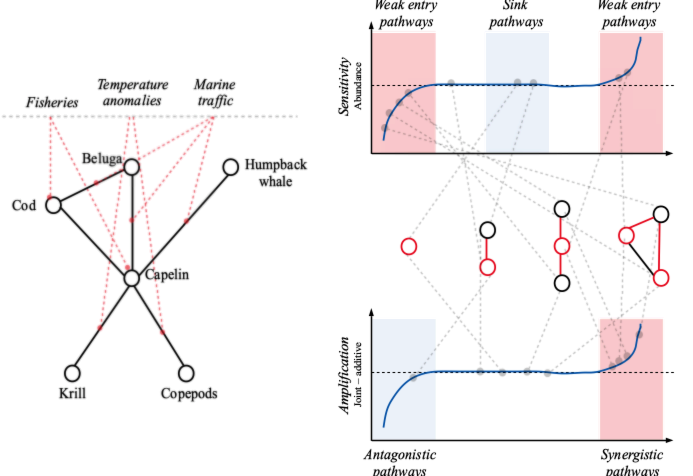

<!--
rmarkdown::render('./FoodWebs-MultipleStressors.md', 'pdf_document')
-->

^1^Institut des sciences de la mer, Université du Québec à Rimouski, Rimouski, QC, Canada \newline
^2^Québec Océan, Département de biologie, Université Laval, Québec, QC, Canada \newline
^3^Department of Integrative Biology, University Of Guelph, Guelph, Ontario, Canada N1G 2W1 \newline
^4^Département de biologie, Université de Sherbrooke, Sherbrooke, QC, Canada \newline

**Correspondence**: \newline
David Beauchesne \newline
david.beauchesne@uqar.ca \newline

\newpage

<!-- ~~~~~~~~~~~~~~~~~~~~~~~~~~~~~~~~~~~~~~~~~~~~~~~~~~~~~~~~~~~~~~~~~~~~~~~ -->
# To do:
<!-- ~~~~~~~~~~~~~~~~~~~~~~~~~~~~~~~~~~~~~~~~~~~~~~~~~~~~~~~~~~~~~~~~~~~~~~~ -->

- [X] Check and adjust for unique pathways of effect (exploitative and apparent competition).
  - They are all unique when you consider the position of the species, except for the disconnected motif.
- [ ] Think on the best way to establish position profile. At the moment what is used is the mean of individual pathways of effect per position, and I feel we could do better.
- [ ] Integrate [@hodgson2019] in the introduction
- [ ] Figure out how to evaluate species motifs position as a probability rather than a frequency. This could make use of empirical diet % available in Ecopath models.
- [ ] Figure out methology to evaluate species profile through two indices: sensitivity score and amplification score. These could be used to adjust Halpern's equation later on.
- [ ] Sensitivity and amplification scores for pathways of effect and motif positions, between [-1 1]
- [ ] Should the delta abundances (%) be divided by the delta parameter (%)?
- [ ] Should the median be used instead of the mean?

# INDEX
Kevin Cazelles
Admettons qu'on est, for a given species:

$$P_{i,j} = P_{position i, motif, i}$$

Then we can define the expected departure/deviance from the additive model, $\bar{D_a}$ as follows:

$$P_{i,j} = \sum_{i,j} D_{a,i,j}P_{position i, motif, i}$$

where $D_{a,i,j}$ is the departure/deviance from the additive model in motif i at postilion j as defined elsewhere.

Tu peux faire ça pour les 2 différentes mesure. Mais ça implique d'avoir les probas! Ça se fait j'imagine, en tout cas on devrais être capable de le faire au moins en simulation.
<!--END INDEX -->

\newpage

<!-- ~~~~~~~~~~~~~~~~~~~~~~~~~~~~~~~~~~~~~~~~~~~~~~~~~~~~~~~~~~~~~~~~~~~~~~~ -->
# Introduction
<!-- ~~~~~~~~~~~~~~~~~~~~~~~~~~~~~~~~~~~~~~~~~~~~~~~~~~~~~~~~~~~~~~~~~~~~~~~ -->

<!-- ~~~~~~~~~~~~~~~~~~~~~~~~~~~~ -->
## Context
<!-- ~~~~~~~~~~~~~~~~~~~~~~~~~~~~ -->

- **Global changes, multiple stressors and food webs**
  - Global changes are resulting in increasingly intricate environmental stress
    exposure regimes [@halpern2015a; @cote2016; @bowler2019]. These can in turn
    induce complex and unpredictable environmental effects that propagate through
    entire ecological communities by way of species interactions
    [@bascompte2009a; @montoya2009].

- **Uncertainty associated with mutliple stressors**
  - Largest uncertainty in predicting environmental effects is the potential for
    complex driver interactions [@cote2016; @darling2008].
  - Stressors can combine non-additively and result in effects that are greater
    (*i.e.* synergistic) or lower (*i.e.* antagonistic) than the sum of
    individual effects [@cote2016; @crain2008; @darling2008]
  - Net effects of multiple stressors can be additive (*i.e.* joint effect
    equal to the sum of individual effects), synergistic (joint effect superior
    to the sum of individual effects), antagonistic (joint effect inferior to
    the sum of individual effects) or dominant (joint effect equal to an
    individual effect) [e.g. @crain2008; @darling2008; @cote2016].
  - This is of particular significance for management, because we have mostly been
    operating under the assumption that stressors are mostly additive and thus
    can be managed independently.
  - Maybe cite [@hodgson2019] (cite it for certain in the article).
  - most research on driver effects in marine environments remains overwhelmingly
    focused on single driver assessments [@obrien2019].

- **Limits of *in situ* and experimental approaches to study multiple disturbances**
  - The number of stressors and of their potential interactions limits the
    insights we can glean into the effects of multiple disturbances *in situ*
    and in experimental settings such as mesocosm [@cote2016].
  - In food webs, this is compounded by the myriad of possible interactions
  - between species

- **Limited insights from null model testing**
  - The knowledge we do have has mostly been gleaned from null model testing
    providing little insights into ecological mecanisms underlying non-additive
    stressor effects [@delaender2018].

- **Shift towards ecological modelling to better understand mecanisms**
  - [@delaender2018; @schafer2018; @thompson2018]

- **Some insights on the effects of disturbances on ecological communities from theoretical ecology**
  - Importance of interactions and web complexity
  - Indirect effects [@wootton1993; @yodzis2000; @wootton2002; @montoya2009; ogorman2009]; see intro séminaire 1
  - Different types of interactions will lead to different overall effects [@refs].
    - Different sensitivity for species involved in different types of interactions (segway to motifs)
  - How direct and indirect effects combine to affect food web sensitivity to disturbances

- **Theoretical has thus far mostly been concerned mostly with single disturbances and
  resistance of communities to extinctions**
  - Little insights into how different pathways of effect influences food webs, let
    alone pathways of multiple effects.
  - Little on the role of species and their interactions in propagating or
    buffering against disturbances

<!-- ~~~~~~~~~~~~~~~~~~~~~~~~~~~~ -->
## Objectives
<!-- ~~~~~~~~~~~~~~~~~~~~~~~~~~~~ -->

1. Objective
2. Pathways of effect
3. Archetypes
4. Motifs
5. Terminology

- **State the objective**
  - Here, we investigate the role of species in mediating the effects of multiple
    disturbances on food webs. We also seek to answer questions of particular
    significance for management: 1) should species interactions be considered in
    impact assessments, and 2) should the effects of stressors be evaluated
    seperately or in combination?
  - OR
  - Here, we focus on evaluating the structural role of species and their
    trophic interactions in mediating food web sensitivity to multiple stressors.
    We also seek to answer questions of particular significance for management:
    1) should species interactions be considered in impact assessments, and
    2) should the effects of stressors be evaluated seperately or in combination?

- **How we do this**
  - To do so, we focus on how trophic position and interaction types affect
    species sensitivity to disturbances and the likelihood of species acting as
    buffer against or amplifiers of the effects of multiple disturbances.

- **Transition to motifs**
  - ...?

- **Motif description and use**
  - A food web can be decomposed into a set of smaller $n$-species subgraphs
    called motifs [@milo2004; @stouffer2007]. For example, there are 13 distinct
    3-species motifs composed of 30 unique positions [@stouffer2007; @stouffer2012].
    Motifs are the backbone of food webs and their study has unearthed
    valuable insights on community dynamics such as [...].
  - Their type and frequency has been linked to food web stability and
    persistence [@ref]
  - Like many disturbance studies in theoretical ecology, however, these have
    focused less on the dynamics of population abundances and more on the
    resistance of food webs to extinctions.
  - Motifs have been used to investigate the persistence of food web to species
    extinctions [@stouffer2010] and the benefit associated to each species in
    food web persistence [@stouffer2012].
  - *The ecological role of a species in a network is a direct rest if its
    interactions with other species (Luczkovich 2003; Olesen 2007; Allesina 2009)
    (in Stouffer 2012)*
  - *The number and types of motifs that make up a food web are known to
    directly affect the web's stability and persistence (Neutel 2002; Kondoh
    2008; Allesina 2008; García-Domingo 2008; Stouffer 2010; in Stouffer 2012)*

- **Our focus**
  - Here we focus on the most abundant types of interactions: omnivory,
    tri-trophic food chain, exploitative competition and apparent competition
    [@stouffer2010; @camacho2007]
  - Two additional motifs, *i.e.* partially connected and disconnected were also
    considered in order to evaluate whether interactions in food webs are truly
    more likely to be characterized by non-linear effects.
  - To study the effects of multiple stressors in a trophic context, we rather
    focus on the resulting disturbances following different pathways of effect
    rather than on the disturbances themselves. This means that we will not
    investigate the effects of multiple stressors applied to a single species
    in the food web. This precludes us from investigating the sensitivity of
    species to each individual stressor. Rather, we investigate the effects of
    disturbances to multiple species simultaneously. But see @thompson2018a and
    @thompson2018 for a description of a modelling approaching incorporating
    multiple sources of stress in a food web model.
  - We are interested in pathways that affect the trophic dynamic of food webs,
    *i.e.* those that target population growth (*i.e.* birth and death rates) and the
    rates at which species interact (*i.e.* attack and conversion rates).

- **Pathways of effect**
  - Studying the effects of multiple disturbances means that we will be focusing
    on disturbances affecting multiple species, referred to as pathways of
    multiple effects ($D_{i,j}$, $D_{i,k}$, $D_{j,k}$, and $D_{i,j,k}$).
  - In a food web context, we will define linear and non-linear effect as a
    function of whether these pathways of multiple effects result in
    additive ($D_{i,j} = D_i + D_j$), synergistic ($D_{i,j} >> D_i + D_j$),
    antagonistic ($D_{i,j} << D_i + D_j$) or dominant ($D_{i,j} = D_i \veebar D_j$)
    effects.

- **Terminology for types of pathways and position profile**
  - Species can occupy different roles in these pathways of multiple effects.
    Investigating species profile [e.g.* @stouffer2012] could thus inform us on
    the role played by individual species in buffering against or amplifying
    the effects of multiple disturbances.
  - We define 4 key roles in species propagating or buffering against multiple
    disturbances:

| Role    | Description | Mathematically | Example                   |
| :------- | :---------  | :----------      |   :---------------------: |
| Weak entry point  | Species directly or indirectly more affected than expected | Synergistic effect on focal species | $S_i$ in $\Delta i | D_{i,j} >> \Delta i | D_i + \Delta i | D_j$ |
| Biotic multiplier | Species propagating disturbances | Peripheral species involved in synergistic effect | $S_j$ in $\Delta i | D_{i,j} >> \Delta i | D_i + \Delta i | D_j$ |
| Biotic sink       | Species directly or indirectly affected less than expected | Antagonistic effect on focal species | $S_i$ in $\Delta i | D_{i,j} << \Delta i | D_i + \Delta i | D_j$ |
| Biotic buffer     | Species blocking the propagation of disturbances | Peripheral species involved in antagonistic effect | $S_j$ in $\Delta i | D_{i,j} << \Delta i | D_i + \Delta i | D_j$ |
| Biotic dominant   | Species whose individual effect dictates the response of other species | Focal or peripheral species driving dominance effect | $S_j$ in $\Delta i | D_{i,j} = \Delta i | D_j$ |

\newpage

<!-- ~~~~~~~~~~~~~~~~~~~~~~~~~~~~~~~~~~~~~~~~~~~~~~~~~~~~~~~~~~~~~~~~~~~~~~~ -->
# Methodology
<!-- ~~~~~~~~~~~~~~~~~~~~~~~~~~~~~~~~~~~~~~~~~~~~~~~~~~~~~~~~~~~~~~~~~~~~~~~ -->

## Models

The dynamics of the four most abundant 3-species motifs (*i.e.* tri-trophic
food chain, omnivory, exploitative and apparent competition) in empirical food
webs [@stouffer2010] were modeled using Lotka-Voltera equation systems (Table S1).
Two additional motifs were included to serve as controls to test the importance of
considering species interactions when evaluating environmental effects, *i.e.*
a partially connected motifs with a disconnected resource and a predator and a prey
interaction, and a fully disconnected motif with three independent species
modelled as resources.

Resources were modeled using logistic growth equations of the form
$\frac{dX_i}{dt} = X_i(r_i - \alpha_{ii} X_i - \sum \alpha_{ij} X_j)$,
where $X$ are species, $i$ is the resource, $j$ are the consumers, $r_i$ is the
intrinsic resource growth rate, $\alpha_{ii}$ is the density-dependent effect of
the resource on itself and $\alpha_{ij}$ is the rate at which consumer $j$
affects resource $i$, i.e. the attack rate.

Consumers and predators were modeled with a Type I functional response of the form
$\frac{dX_j}{dt} = X_j(-m_j + \sum e_{ij} \alpha_{ij} X_i - \alpha_{jk} X_k)$,
where $m$ is the mortality rate and $e$ is the rate at which resource biomass is
transformed into consumer biomass, *i.e.* the conversion rate. $e$ is a scaling
parameter of the attack rate which cannot exceed 1, since 1 unit of resource
biomass cannot be transformed into more than 1 unit of consumer biomass.

Models were solved at equilibrium since we wished to study the dynamics of the
motifs in the context of persistent food webs, which is closer to reality.
As no equilibrium exists for the exploitative competition motif with
Lotka-Voltera models of these forms, competitive parameters of the form
$\alpha_{jj} \alpha_{jk} X_j X_k - \alpha_{jj} X_j^2$ were included in the
consumer models to constrain their growth and obtain equilibrium solutions.
Sage [@ref] was used to solve all equation systems at equilibrium. All other
analyses were performed using R [@ref]. All code and data used to perform the
simulations and analyses are available at [...].

Initial model parameter values for intrinsic growth ($r$) and resource
density-dependence ($\alpha_{ii}$) parameters were fixed to 1 and 0.001,
respectively, to bound all solutions. Competitive parameters for the
exploitative competition motif were also fixed at 0.001 since those parameters
were not to be investigated in our analyses. Conversion rates ($e$) were fixed
to 0.5. Finally, a total of 100 sets of mortality ($m$) and attack rates
($\alpha_{ij}$) were evaluated using a simulated annealing
algorithm optimizing for consumer abundance.

## Disturbances

Parameters selected to simulate disturbances were those related to
population growth ($r$ and $m$) and interaction rates ($e$ and $\alpha_{ij}$).
Disturbances were simulated by applying a 1% variation on all combinations of
selected model parameters to simulate all possible unique pathways of
univariate and multivariate effects. Parameter variation were only applied as a
simulation of stress, hence mortality rates were increased, while all other
parameters were decreased by 1%.

Parameter combinations resulted in between 7 (disconnected) and 511 (omnivory
possible pathways of effect, for a total of 930 unique pathways of effects
(*to check, I may be multiplying the number of unique pathways for
exploitative and apparent competition*).

The sensitivity to disturbances was measured as percent change between the
analytical abundance after parameter variation and the initial abundance,
for each species and each pathway of effect. The amplication potential of
pathways of multiple effects was measured as percent difference between the
analytical abundance of the multivariate disturbance model and the sum of the
univariate disturbance models. A value of 0 equals a null or additive effect,
a value below 0 is a dominant or antagonistic effect, and a value over 0 is a
synergistic effect.

## Sensitivity and amplification scores

### Pathways of effects

Sensitivity and amplification scores for individual pathways of effects, motif
positions and motifs were evaluated by [...]

### Motif positions

The sensitiivity score was calculated for each motif position by taking the
mean absolute value of the percent abundance change between initial and
disturbed models for all pathways of effect. This means that a value of 1 is
a percent change in abundance equal to the percent change in parameter value
to simulate a disturbance, a value below 1 is a percent abundance change lower
than the simulated disturbance, and a value above 1 is a percent abundance
change greater than the percent parameter change.

Similarly, the amplification score was measure by adding 1 to the difference
between the joint model and the additive model, so that antagonistic and
synergistic effects are centered on 1 rather than 0.

### Food web

Single species sensitivity and amplification profiles were evaluated by
multiplying the frequency at which they appear in each motif position by
the sensitivity and amplification scores.

$$Score_{species} = Frequency * Sensititivity * Amplification$$

## Empirical food webs

We used 5 food webs from the Estuary and Gulf of St. Lawrence

\newpage

<!-- ~~~~~~~~~~~~~~~~~~~~~~~~~~~~~~~~~~~~~~~~~~~~~~~~~~~~~~~~~~~~~~~~~~~~~~~ -->
# Results
<!-- ~~~~~~~~~~~~~~~~~~~~~~~~~~~~~~~~~~~~~~~~~~~~~~~~~~~~~~~~~~~~~~~~~~~~~~~ -->

## Disturbances

\begin{figure}[H]
\centering
\includegraphics{./Figures/disturbances.png}
\caption{Disturbances. Line 1: Univariate disturbances; Line 2: Multivariate disturbances; Line 3: Joint - additive disturbances}
\label{disturbances}
\end{figure}

\newpage

\begin{figure}[H]
\centering
\includegraphics{./Figures/positions.png}
\caption{Morif positions and disturbances}
\label{positions}
\end{figure}

\newpage

## Empirical food webs

\begin{figure}[H]
\centering
\includegraphics{./Figures/positionFrequencySL.png}
\caption{Frequency in which each species of three empirical food webs are found in each motif position.}
\label{posFreq}
\end{figure}

\newpage

\begin{figure}[H]
\centering
\includegraphics{./Figures/speciesSensitivity.png}
\caption{Sensitivity scores for species in the food webs of the southern St. Lawrence, northern St. Lawrence, and the estuary of St. Lawrence}
\label{spScore}
\end{figure}

\newpage

\begin{figure}[H]
\centering
\includegraphics{./Figures/TL-OM.png}
\caption{Sensitivity scores as a function of trophic level and omnivory index}
\label{tlom}
\end{figure}

\newpage

## Empirical food webs impact scores

\begin{figure}[H]
\centering
\includegraphics{./Figures/speciesImpact.png}
\caption{Impact scores for species in the food webs of the southern St. Lawrence, northern St. Lawrence, and the estuary of St. Lawrence}
\label{spImpact}
\end{figure}

\newpage

\begin{figure}[H]
\centering
\includegraphics{./Figures/TL-OM-Impact.png}
\caption{Impact scores as a function of trophic level and omnivory index}
\label{tlom-Imp}
\end{figure}

\newpage

<!-- ~~~~~~~~~~~~~~~~~~~~~~~~~~~~~~~~~~~~~~~~~~~~~~~~~~~~~~~~~~~~~~~~~~~~~~~ -->
# Supplementary Figures
<!-- ~~~~~~~~~~~~~~~~~~~~~~~~~~~~~~~~~~~~~~~~~~~~~~~~~~~~~~~~~~~~~~~~~~~~~~~ -->

\begin{figure}[H]
\centering
\includegraphics{./Figures/nParam.png}
\caption{Mean delta abundance and difference between joint and additive models as a function of the number of parameters}
\label{nParam}
\end{figure}

\newpage

\begin{figure}[H]
\centering
\includegraphics{./Figures/paramType.png}
\caption{Mean delta abundance and difference between joint and additive models as a function of the types of parameters, i.e. growth/mortality rates, attack rates and conversion rates}
\label{nParam}
\end{figure}

\newpage

<!-- ~~~~~~~~~~~~~~~~~~~~~~~~~~~~~~~~~~~~~~~~~~~~~~~~~~~~~~~~~~~~~~~~~~~~~~~ -->
# Supplementary Material
<!-- ~~~~~~~~~~~~~~~~~~~~~~~~~~~~~~~~~~~~~~~~~~~~~~~~~~~~~~~~~~~~~~~~~~~~~~~ -->

## Models

\begin{table}[H]
\centering
\renewcommand{\arraystretch}{1.25}
\begin{tabular}{p{12.67ex} | l | l}
\hline
\textbf{Motifs} & \textbf{Equation systems} & \textbf{Initial parameters values} \\[0.5ex]
\hline\hline
% ------------------------------------------------
Tri-trophic food chain &
$\begin{array} {lcl}
  \frac{dX_i}{dt} &=& X_i(r_i - \alpha_{ii} X_i - \alpha_{ij} X_j) \\
  \frac{dX_j}{dt} &=& X_j(e_{ij} \alpha_{ij} X_i - \alpha_{jk} X_k - m_j) \\
  \frac{dX_k}{dt} &=& X_k(e_{jk} \alpha_{jk} X_j - m_k)
\end{array}$ &
$\begin{array} {lcl}
  r_i = 1 \\
  \alpha_{ii} = 0.001 \\
  \alpha_{ij}, \alpha_{jk} \in [0.0001, 0.01] \\
  e_{ij}, e_{jk} = 0.5 \\
  m_j, m_k \in [0.01, 0.5]
\end{array}$ \\
\hline
% ------------------------------------------------
Omnivory &
$\begin{array} {lcl}
  \frac{dX_i}{dt} &=& X_i(r_i - \alpha_{ii} - \alpha_{ij} X_j - \alpha_{ik} X_k) \\
  \frac{dX_j}{dt} &=& X_j(e_{ij} \alpha_{ij} X_i - \alpha_{jk} X_k - m_j) \\
  \frac{dX_k}{dt} &=& X_k(e_{ik} \alpha_{ik} X_i + e_{jk} \alpha_{jk} X_j - m_k) \\
\end{array}$ &
$\begin{array} {lcl}
  r_i = 1 \\
  \alpha_{ii} = 0.001 \\
  \alpha_{ij}, \alpha_{ik}, \alpha_{jk} \in [0.0001, 0.01] \\
  e_{ij}, e_{ik}, e_{jk} = 0.5 \\
  m_j, m_k \in [0.01, 0.5]
\end{array}$ \\
\hline
% ------------------------------------------------
Exploitative competition &
$\begin{array} {lcl}
  \frac{dX_i}{dt} &=& X_i(r_i - \alpha_{ii} - \alpha_{ij} X_j - \alpha_{ik} X_k) \\
  \frac{dX_j}{dt} &=& X_j(e_{ij} \alpha_{ij} X_i - \alpha_{jj}\alpha_{jk}X_k - \alpha_{jj}X_j - m_j) \\
  \frac{dX_k}{dt} &=& X_k(e_{ik} \alpha_{ik} X_i - \alpha_{kk}\alpha_{kj}X_j - \alpha_{kk}X_k - m_k) \\
  \end{array}$ &
  $\begin{array} {lcl}
    r_i = 1 \\
    \alpha_{ii}, \alpha_{jj}, \alpha_{kk}, \alpha_{jk}, \alpha_{kj} = 0.001 \\
    \alpha_{ij}, \alpha_{ik}, \in [0.0001, 0.01] \\
    e_{ij}, e_{ik} = 0.5 \\
    m_j, m_k \in [0.01, 0.5]
  \end{array}$ \\
\hline
% ------------------------------------------------
Apparent competition &
$\begin{array} {lcl}
  \frac{dX_i}{dt} &=& X_i(r_i - \alpha_{ii} X_i - \alpha_{ik} X_k) \\
  \frac{dX_j}{dt} &=& X_j(r_j - \alpha_{jj} X_j - \alpha_{jk} X_k) \\
  \frac{dX_k}{dt} &=& X_k(e_{ik} \alpha_{ik} X_i + e_{jk} \alpha_{jk} X_j - m_k)
  \end{array}$ &
  $\begin{array} {lcl}
    r_i, r_j = 1 \\
    \alpha_{ii}, \alpha_{jj} = 0.001 \\
    \alpha_{ik}, \alpha_{jk} \in [0.0001, 0.01] \\
    e_{ik}, e_{jk} = 0.5 \\
    m_k \in [0.01, 0.5]
  \end{array}$ \\
\hline
% ------------------------------------------------
Partially disconnected &
$\begin{array} {lcl}
  \frac{dX_i}{dt} &=& X_i(r_i - \alpha_{ii} X_i - \alpha_{ik} X_k) \\
  \frac{dX_j}{dt} &=& X_j(r_j - \alpha_{jj} X_j) \\
  \frac{dX_k}{dt} &=& X_k(e_{ik} \alpha_{ik} X_i - m_k)
  \end{array}$ &
  $\begin{array} {lcl}
    r_i, r_j = 1 \\
    \alpha_{ii}, \alpha_{jj} = 0.001 \\
    \alpha_{ik} \in [0.0001, 0.01] \\
    e_{ik} = 0.5 \\
    m_k \in [0.01, 0.5]
  \end{array}$ \\
\hline
% ------------------------------------------------
Disconnected &
$\begin{array} {lcl}
  \frac{dX_i}{dt} &=& X_i(r_i - \alpha_{ii} X_i) \\
  \frac{dX_j}{dt} &=& X_j(r_j - \alpha_{jj} X_j) \\
  \frac{dX_k}{dt} &=& X_k(r_k - \alpha_{kk} X_k)
  \end{array}$ &
  $\begin{array} {lcl}
    r_i, r_j, r_k = 1 \\
    \alpha_{ii}, \alpha_{jj}, \alpha_{kk} = 0.001 \\
  \end{array}$ \\
\hline
\end{tabular}
\caption{Systems of Lotka-Volterra equations used to model the effect of multiple disturbances}
\label{equations}
\end{table}

\newpage

<!-- ~~~~~~~~~~~~~~~~~~~~~~~~~~~~~~~~~~~~~~~~~~~~~~~~~~~~~~~~~~~~~~~~~~~~~~~ -->
# Next points
<!-- ~~~~~~~~~~~~~~~~~~~~~~~~~~~~~~~~~~~~~~~~~~~~~~~~~~~~~~~~~~~~~~~~~~~~~~~ -->

- Non-linear effects in motifs
- Species contribution to non-linear effects
- Species profiles (frequency of times occupying roles that contribute to non-linear effects; see @stouffer2012)
- Graphs to present these results
- Methods

<!-- ~~~~~~~~~~~~~~~~~~~~~~~~~~~~~~~~~~~~~~~~~~~~~~~~~~~~~~~~~~~~~~~~~~~~~~~ -->
# Notes - to explore
<!-- ~~~~~~~~~~~~~~~~~~~~~~~~~~~~~~~~~~~~~~~~~~~~~~~~~~~~~~~~~~~~~~~~~~~~~~~ -->

- With synergies, one should expect higher rates of community collapse, i.e. loss
of species to extinction, because the effects increase more rapidly. Maybe look
at Stouffer to better dissect their result on community persistence as a function
of motifs. Perhaps they also explain which are the motif positions that tend to
go extinct more rapidly?

<!-- ~~~~~~~~~~~~~~~~~~~~~~~~~~~~~~~~~~~~~~~~~~~~~~~~~~~~~~~~~~~~~~~~~~~~~~~ -->
# Interesting points
<!-- ~~~~~~~~~~~~~~~~~~~~~~~~~~~~~~~~~~~~~~~~~~~~~~~~~~~~~~~~~~~~~~~~~~~~~~~ -->

- Effect limit [@schafer2018]: maximum effect size for a response (*e.g.* 100% mortality, zero growth or reproduction)

<!-- ~~~~~~~~~~~~~~~~~~~~~~~~~~~~~~~~~~~~~~~~~~~~~~~~~~~~~~~~~~~~~~~~~~~~~~~ -->
# Literature to cite - or at least look at!
<!-- ~~~~~~~~~~~~~~~~~~~~~~~~~~~~~~~~~~~~~~~~~~~~~~~~~~~~~~~~~~~~~~~~~~~~~~~ -->

- @adams2005
- @brown2013
- @brown2014
- @christensen2006
- @crain2008
- @darling2013
- @folt1999
- @galic2018 *
- @jackson2016
- @kath2018
- @lange2018
- @piggott2015
- @schafer2018 *
- @segner2014
- @thompson2018
- @thompson2018a
- @vinebrooke2004

\newpage

<!-- ~~~~~~~~~~~~~~~~~~~~~~~~~~~~~~~~~~~~~~~~~~~~~~~~~~~~~~~~~~~~~~~~~~~~~~~ -->
# References
<!-- ~~~~~~~~~~~~~~~~~~~~~~~~~~~~~~~~~~~~~~~~~~~~~~~~~~~~~~~~~~~~~~~~~~~~~~~ -->

<!--
## Tri-trophic chain

\begin{eqnarray}
  \nonumber \frac{dx}{dt} &=& x(r - \alpha x - \beta y) \\
  \nonumber \frac{dy}{dt} &=& y(\mu \beta x - \delta z - m_y) \\
  \nonumber \frac{dz}{dt} &=& z(\omega \delta y - m_z) \\
\end{eqnarray}

## Omnivory

\begin{eqnarray}
  \nonumber \frac{dx}{dt} &=& x(r - \alpha x - \beta y - \gamma z) \\
  \nonumber \frac{dy}{dt} &=& y(\mu \beta x - \delta z - m_y) \\
  \nonumber \frac{dz}{dt} &=& z(\nu \gamma x + \omega \delta y - m_z) \\
\end{eqnarray}

## Exploitative competition

\begin{eqnarray}
  \nonumber \frac{dx}{dt} &=& -{\left(\mathit{\alpha_{xx}} x + b y + g z - r\right)} x \\
  \nonumber \frac{dy}{dt} &=& {\left(b u x - \mathit{ajj} \mathit{ajk} z - \mathit{ajj} y - \mathit{my}\right)} y \\
  \nonumber \frac{dz}{dt} &=& {\left(g v x - \mathit{akj} \mathit{akk} y - \mathit{akk} z - \mathit{mz}\right)} z \\
\end{eqnarray}

## Apparent competition

\begin{eqnarray}
  \nonumber \frac{dx}{dt} &=& x(r_x - \alpha_x x - \gamma z) \\
  \nonumber \frac{dy}{dt} &=& y(r_y - \alpha_y y - \delta z) \\
  \nonumber \frac{dz}{dt} &=& z(\nu \gamma x + \omega \delta y - m_z) \\
\end{eqnarray}

## Partially disconnected

\begin{eqnarray}
  \nonumber \frac{dx}{dt} &=& x(r_x - \alpha_x x - \beta y) \\
  \nonumber \frac{dy}{dt} &=& y(\mu \beta x - m_y) \\
  \nonumber \frac{dz}{dt} &=& z(r_z - \alpha_z z) \\
\end{eqnarray}

## Disconnected

\begin{eqnarray}
  \nonumber \frac{dx}{dt} &=& x(r_x - \alpha_x x) \\
  \nonumber \frac{dy}{dt} &=& y(r_y - \alpha_y y) \\
  \nonumber \frac{dz}{dt} &=& z(r_z - \alpha_z z) \\
\end{eqnarray}
-->
