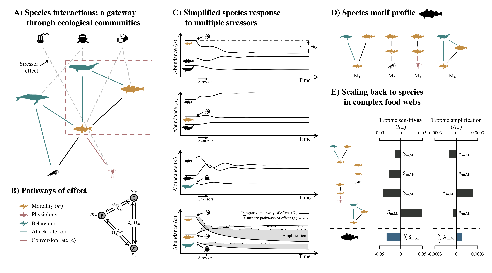

<!--
rmarkdown::render('./FoodWebs-MultipleStressors.md')
-->

^1^Institut des sciences de la mer, Université du Québec à Rimouski, Rimouski, QC, Canada \newline
^2^Québec Océan, Département de biologie, Université Laval, Québec, QC, Canada \newline
^3^Department of Integrative Biology, University Of Guelph, Guelph, Ontario, Canada N1G 2W1 \newline
^4^Département de biologie, Université de Sherbrooke, Sherbrooke, QC, Canada \newline

**Running title**: \newline <!-- < 45 characters including spaces -->

**Keywords**: \newline <!-- <= 10 -->

**Type of article**: Ideas and Perspectives \newline

**Abstract word count**: \newline
**Main text word count**: \newline<!-- excluding abstract, acknowledgements, references, table and figure legends -->
<!-- **Text box word count**: One for each box, if applicable -->
**Number of references**: \newline
**Number of figures**: \newline
**Number of tables**: \newline
**Number of text boxes**: \newline

**Correspondence**: \newline
David Beauchesne \newline
david.beauchesne@uqar.ca \newline
1-514-553-4975\newline

**Statement of authorship**: \newline

**Data accessibility statement**:

\newpage

<!-- ~~~~~~~~~~~~~~~~~~~~~~~~~~~~~~~~~~~~~~~~~~~~~~~~~~~~~~~~~~~~~~~~~~~~~~~ -->
# Checklist {-}
<!-- ~~~~~~~~~~~~~~~~~~~~~~~~~~~~~~~~~~~~~~~~~~~~~~~~~~~~~~~~~~~~~~~~~~~~~~~ -->

- [ ] Proposal letter Ecology Letters - Ideas and Perspectives
- [ ] Cover letter and novelty statement
- [x] Conflict of interest statement
- [ ] Statement of authorship
- [ ] Data accessibility statement
- [ ] Reviewers
- [ ] Keywords
- [ ] Abstract
- [ ] Introduction
- [ ] Of food webs and multiple disturbances (concept)
- [ ] Simulations
- [ ] Sensitivity
- [ ] Amplification
- [ ] Food web sensitivity & amplification
- [ ] Conclusions
- [ ] Acknowledgements
- [ ] References
- [ ] Figure 1 - Concept
- [ ] Figure 2 - Sensitivity
- [ ] Figure 3 - Amplification
- [ ] Figure 4 - Food web scores table
- [ ] Figure 5 - Topological ~ Realised scores
- [ ] Figure 6 - Scores ~ Trophic level & degree
- [ ] Table S1 - Systems of equations
- [ ] Article formatting

\newpage

<!-- ~~~~~~~~~~~~~~~~~~~~~~~~~~~~~~~~~~~~~~~~~~~~~~~~~~~~~~~~~~~~~~~~~~~~~~~ -->
# Plan {-}
<!-- ~~~~~~~~~~~~~~~~~~~~~~~~~~~~~~~~~~~~~~~~~~~~~~~~~~~~~~~~~~~~~~~~~~~~~~~ -->

- **Abstract**

- **Introduction**
  - Global changes and disturbances propagation through food webs
  - Uncertainty associated with multiple disturbances
  - Limits of *in situ* and experimental approaches to study multiple disturbances
  - Limited insights from null model testing
  - Shift towards ecological modelling to better understand mecanisms
  - Insights on the effects of disturbances on ecological communities from theoretical ecology
  - Theoretical focus on single disturbances, coexistence and extinctions

- **Objectives**
  - Investigate the role of species and their interactions in mediating the effects of multiple
      disturbances on food webs.
  - Questions of particular significance to management:
    1) should interactions be considered in impact assessments?
    2) can the effects of stressors be evaluated seperately or should they be considered in combination?
    3) which species are most sensitive to disturbances based on their trophic position?

- **Of food webs and multiple disturbances**
  <!-- - Concepts underlying the study of disturbances on food webs -->
  - [1] Food web dynamics
  - [2] Indirect effects
  - [3] Environmental pressures
  - [4] Effects of disturbances on food webs
    - What we know: robustness to extinctions, importance of indirect effects
  - [5] Pathways of effects
  - [6] Non-additive effects
  - [7] Topology (trophic position and interaction types)
  - [8] Motifs
    - to understand how topology influences sensitivity to and amplification of disturbances
  - [9] Archetypes
  - [10] Subweb dynamics/insights (Holt 1997; Stouffer 2007)
  - [11] Definitions - pathway, trophic (position), biotic (species)
    - Weak entry points
    - Sinks
    - Buffers (cite Montoya et al. 2009)
    - Multipliers

\begin{figure}[H]
\centering
\includegraphics[width=0.25\columnwidth]{./Figures/Concept.png}
\label{f1}
\end{figure}

- **Simulating multiple disturbances on food webs**
  - Method for simulations:
    - Exhaustive investigation of how topology affects species abundance at
    - equilibrium to univariate and multivariate pathways of effects

- **Topology and sensitivity**
  - Method: Comparison between initial and disturbed abundance: trophic sensitivity
  - Amplitude of effects is highly variable, and much higher for multivariate pathways of effects
  - Importance of considering species interactions
    - Univariate pathways of effects simulations clearly show that interactions influence the amplitude of the effects of disturbances
    - Complex interactions = greater variability
    - Control motifs (disconnected & )
  - Species position and interaction type leads to varying sensitivity
    - Interactions generaly amplify effects on species
    - Control motifs largely unaffected
    - Complex interactions more sensitive (i.e. tri-trophic food chain and omnivory)
    - Competitive interactions (Competitive and apparent competition) less sensitive
    - Basal resources and top predators generally more sensitive
    <!-- Look at position frequency ~ defined position (sinks and weak entry points) -->
    <!-- Direct vs indirect effects -->

\begin{figure}[H]
\centering
\includegraphics[width=0.25\columnwidth]{./Figures/sensitivity.png}
\label{f2}
\end{figure}

- **Topology and amplification**
  - Method: Comparison between full models considering all pathways of effects simultaneously and additive models considering the sum of the effects of univariate pathways of effect to identify antagonistic, additive and synergistic pathways of effect: trophic amplification
  - Frequency and variability of non-additive effects more important for omnivory and tri-trophic chain.
  - Predator release for resources or meso-predators (positive effects)
  - Limited non-additive effects for control motifs
  - Competition: antagonisme
  - Complex interactions: more non-additive effects, dominated by synergistic effects for consumers
  <!-- Look at position frequency ~ defined position (buffers and multipliers) -->

\begin{figure}[H]
\centering
\includegraphics[width=0.25\columnwidth]{./Figures/amplification.png}
\label{f3}
\end{figure}

- **Complex food webs**
  - Method: Topological and realised sensitivity and amplification scores; expert opinion on effects of drivers on mortality, physiology and behaviour.
  - Empirical food web: Northern Gulf of St. Lawrence, prior to the groundfish stock collapse in the 1990s
  - Topological vs realised scores
    - Interpret biplots
  - Trophic level
    - Realised sensitivity non-linear with trophic level. Lower and higher trophic levels have low sensitivity scores, while intermediate trophic levels have null or positive sensitivity scores
    - Realised Aaplification looks like a sinusoid, with antagonism at low trophic levels which increases to synergism towards intermediate trophic levels. It then drops to antagonisms again at intermediate trophic levels and then increases again towards synergisms for higher trophic levels.
  - Food web:
    - Few biotic sinks, more negative weak entry points
    - Very few biotic buffers, many biotic multipliers
    - A species does not have to be impacted directly to have large trophic sensitivity and amplification scores (*e.g.* seals and seabirds), and direct disturbances do not necessarily result in sensitivity or amplification.
    - Groundfish collapse: decrease in groundfish species and increase in invertebrates, crustaceans and shrimp (economical shift ensued with fisheries now focused on those species)
      - Groundfish species are negative weak entry points and biotic multipliers
      - Large crustaceans positive weak entry point and biotic multiplier
      - Shrimp biotic sink
      - Check up on capelin populations post stock collapse

\begin{figure}[H]
\centering
  \begin{subfigure}[b]{0.25\textwidth}
    \includegraphics[width=\textwidth]{./Figures/ScoreTableNSL.png}
  \end{subfigure}
  \begin{subfigure}[b]{0.25\textwidth}
    \includegraphics[width=\textwidth]{./Figures/TL-OM.png}
  \end{subfigure}
  \begin{subfigure}[b]{0.25\textwidth}
    \includegraphics[width=\textwidth]{./Figures/Biplots.png}
  \end{subfigure}
\end{figure}

- **Conclusions**
  - Complex interactions = more sensitive and non-additive effects
  - Meso-predator in complex interactions or resources in apparent competition = predator release
  - Competitive interactions = less sensitive and more antagonism
  - Mecanistic understanding
  - Probabilities
  - Management

\newpage

<!-- ~~~~~~~~~~~~~~~~~~~~~~~~~~~~~~~~~~~~~~~~~~~~~~~~~~~~~~~~~~~~~~~~~~~~~~~ -->
# To do: {-}
<!-- ~~~~~~~~~~~~~~~~~~~~~~~~~~~~~~~~~~~~~~~~~~~~~~~~~~~~~~~~~~~~~~~~~~~~~~~ -->

- [ ] Proposal for Ecology Letters Ideas and Perspectives
- [x] Check and adjust for unique pathways of effect (exploitative and apparent competition).
  - They are all unique when you consider the position of the species, except for the disconnected motif.
- [ ] Think on the best way to establish position profile. At the moment what is used is the mean of individual pathways of effect per position, and I feel we could do better. ***Perhaps with maximal positional scores.***
- [ ] Integrate [@hodgson2019] in the introduction
- [x] Figure out how to evaluate species motifs position as a probability rather than a frequency. This could make use of empirical diet % available in Ecopath models. -> This will be discussed in this paper, and developed in the subsequent spatial paper
- [x] Figure out methology to evaluate species profile through two indices: sensitivity score and amplification score. These could be used to adjust Halpern's equation later on.
- [ ] Cheung, W.W.L., Sarmiento, J.L., Dunne, J., Frolicher, T.L., Lam, V.W.Y., Palomares, M.L.D., Watson, R., and Pauly, D. 2013. Shrinking of fishes exacerbates impacts of global ocean changes on marine ecosystems. Nature Climate Change 3: 254-258.
- [ ] Uniformiser les indices dans les équations de l'article
- [x] Modify the score for species using realised pathways of effects. I thougth that this was done, but since we are not using probabilities, I'm not sure what I should be doing anymore with this. Ideally I would still use a probability and have a general function, but we might still want to keep this for the 4th chapter of the thesis. -> in 4th chapter.
- [ ] Verify all codes so that the proper equations are used
- [ ] Update thresholds used
- [ ] Give proper credit to icons and images used
- [ ] Sensitivity and amplification ~ in- and out-degree
- [ ] Figure ex. biotic multiplier ~ position
- [ ] Evaluate realised score potential (maximum) for each position. Not all pathways could be realised simultaneously, since when a multivariate pathway of effect exists, all of its constituent pathways cannot exist anymore. We could therefore come up with a maximal sensitivity and amplification score. We could then check the maximal possible score for a species and see whether we are close to it or not. Since there can only be a single realised pathway between 3 species, the maximum score would be the pathway of effect with the highest sensitivity and the one with the higher amplification score.
- [ ] Check whether the unsensitivity of resources in competitive exploitation is due to the competitive parameters added to the models to get to equilibrium
- [ ] If indirect effects are as important as direct effects, then it means that to better understand the impacts of disturbances, it may be as important to look at species beyond our focal species of interest.
- [ ] ***HAve to look into the importance of direct vs indirect effects***

\newpage

<!-- ~~~~~~~~~~~~~~~~~~~~~~~~~~~~~~~~~~~~~~~~~~~~~~~~~~~~~~~~~~~~~~~~~~~~~~~ -->
# Proposal letter {-}

<!-- ~~~~~~~~~~~~~~~~~~~~~~~~~~~~~~~~~~~~~~~~~~~~~~~~~~~~~~~~~~~~~~~~~~~~~~~ -->
<!-- ## Instructions

*Unsolicited proposals, which will be evaluated by the Ideas
and Perspectives or Reviews and Syntheses Editors, in consultation with the
Editorial Board and Editor-in-Chief, prior to a full submission. Proposals
should be no more than 300 words long, describe the nature and novelty of the
work, the contribution of the proposed article to the discipline, and the
qualifications of the author(s) who will write the manuscript. Proposals should
be sent to the Editorial Office (ecolets@cefe.cnrs.fr).* -->

\newpage

<!-- ~~~~~~~~~~~~~~~~~~~~~~~~~~~~~~~~~~~~~~~~~~~~~~~~~~~~~~~~~~~~~~~~~~~~~~~ -->
# Cover letter and novelty statement {-}
<!-- ~~~~~~~~~~~~~~~~~~~~~~~~~~~~~~~~~~~~~~~~~~~~~~~~~~~~~~~~~~~~~~~~~~~~~~~ -->
<!-- ## Instructions
*The covering letter to the Editorial Office should succinctly describe why the enclosed work is novel, exciting and of
general interest in ecology.*

*Additionally, the covering letter should include a clear statement of exactly how the present manuscript is
outstandingly novel relative to recent work by the author or coauthors cited in the present submission. At the time
of submission, PDFs of any recent manuscripts or book chapters by the author or coauthors and cited in the present
submission must be uploaded as supporting files. This includes all cited manuscripts by the author or coauthors
published this year, last year, in press or submitted. These files are made accessible to referees with the
understanding that "in press" and "submitted" manuscripts represent privileged communications which may not be
cited or used in any way other than for reference while reviewing the current manuscript. If there is a particular
reason why a file should not be made available to reviewers, please point this out and provide an explanation in the
cover letter.* -->

## Letter {-}

## Documents joined {-}

<!-- ~~~~~~~~~~~~~~~~~~~~~~~~~~~~~~~~~~~~~~~~~~~~~~~~~~~~~~~~~~~~~~~~~~~~~~~ -->
# Reviewers {-}
<!-- ~~~~~~~~~~~~~~~~~~~~~~~~~~~~~~~~~~~~~~~~~~~~~~~~~~~~~~~~~~~~~~~~~~~~~~~ -->

**Proposed reviewers**:

- Reviewer 1
- Reviewer 2
- Reviewer 3

**Conflicts of interest**:

- In-conflict individual and reason

# Conflict of interest statement {-}

The authors declare that the submitted work was carried out in the absence of
any personal, professional or financial relationships that could potentially be
construed as a conflict of interest.

\newpage

<!-- ~~~~~~~~~~~~~~~~~~~~~~~~~~~~~~~~~~~~~~~~~~~~~~~~~~~~~~~~~~~~~~~~~~~~~~~ -->
# Abstract
<!-- ~~~~~~~~~~~~~~~~~~~~~~~~~~~~~~~~~~~~~~~~~~~~~~~~~~~~~~~~~~~~~~~~~~~~~~~ -->

Global changes are resulting in increasingly intricate environmental stress
exposure regimes. These can in turn induce complex and unpredictable environmental
effects permeating entire ecological communities by way of species interactions.

The role of species and their interactions in mediating the effects of multiple
disturbances on food webs is however still understudied. Experimental and
*in situ* approaches provide limited insight, while theoretical approaches have
yet to fully tackle the issue.

Using Lotka-Volterra equilibria models of the 4 most common 3-species motifs in
empirical food webs, we show that trophic position and interaction type
influence the sensitivity to and the amplification of the effects of multiple
disturbances.

We then show that how species are embedded in complex food webs and the types of
disturbances they are exposed to dictates their sensitivity to multiple sources
of stress.

Our results illustrate the importance of explictely considering species
interactions to properly capture the effects of multiple stressors and
safeguard ecological communities against global changes.

Global changes are creating intricate stress exposure regimes that induce unpredictable environmental effects permeating entire ecological communities by way of species interactions. The role of species and their interactions in mediating the effects of multiple disturbances on food webs remains understudied. Experimental and *in situ* approaches provide contextual insights, while theory has yet to fully tackle the issue. Using Lotka-Volterra models, we show that topology (i.e. trophic position and interaction type) influences the sensitivity to and the amplification of the effects of multiple disturbances. We show that species position in complex food webs and the types and combinations of disturbances they are exposed to dictates their sensitivity to multiple sources of stress. Our results illustrate the importance of considering species interactions and non-additive effects to capture the effects of multiple disturbances and safeguard ecological communities against global changes.

Contribution: we define multiple types of ecological outcomes from different pathways of effects, i.e. weak entry points, biotic sinks, biotic buffers and biotic amplifiers.

Surprises: non-additive effects
Interactions: affects the amplitude of the predicted effects of disturbances
Explain why 2 disturbances make the situation more complex when considering interactions

<!-- Even if evidence indicates that holistic approaches should be favoured to
study complex environmental phenomena, studies nonetheless still overwhelmingly
focus on single-stressor and single-species evalutions. -->

\newpage

<!-- ~~~~~~~~~~~~~~~~~~~~~~~~~~~~~~~~~~~~~~~~~~~~~~~~~~~~~~~~~~~~~~~~~~~~~~~ -->
# Introduction
<!-- ~~~~~~~~~~~~~~~~~~~~~~~~~~~~~~~~~~~~~~~~~~~~~~~~~~~~~~~~~~~~~~~~~~~~~~~ -->

- **Global changes, multiple stressors and food webs**
  - Global changes are resulting in increasingly intricate environmental stress
    exposure regimes [@halpern2015a; @cote2016; @bowler2019]. These can in turn
    induce complex and unpredictable environmental effects that propagate through
    entire ecological communities by way of species interactions
    [@bascompte2009a; @montoya2009].

- **Uncertainty associated with mutliple stressors**
  - Largest uncertainty in predicting environmental effects is the potential for
    complex driver interactions [@cote2016; @darling2008].
  - Stressors can combine non-additively and result in effects that are greater
    (*i.e.* synergistic) or lower (*i.e.* antagonistic) than the sum of
    individual effects [@cote2016; @crain2008; @darling2008]
  - Net effects of multiple stressors can be additive (*i.e.* joint effect
    equal to the sum of individual effects), synergistic (joint effect superior
    to the sum of individual effects), antagonistic (joint effect inferior to
    the sum of individual effects) or dominant (joint effect equal to an
    individual effect) [e.g. @crain2008; @darling2008; @cote2016].
  - This is of particular significance for management, because we have mostly been
    operating under the assumption that stressors are mostly additive and thus
    can be managed independently.
  - Maybe cite [@hodgson2019] (cite it for certain in the article).
  - most research on driver effects in marine environments remains overwhelmingly
    focused on single driver assessments [@obrien2019].

- **Limits of *in situ* and experimental approaches to study multiple disturbances**
  - The number of stressors and of their potential interactions limits the
    insights we can glean into the effects of multiple disturbances *in situ*
    and in experimental settings such as mesocosm [@cote2016].
  - In food webs, this is compounded by the myriad of possible interactions
  - between species

- **Limited insights from null model testing**
  - The knowledge we do have has mostly been gleaned from null model testing
    providing little insights into ecological mecanisms underlying non-additive
    stressor effects [@delaender2018].

- **Shift towards ecological modelling to better understand mecanisms**
  - [@delaender2018; @schafer2018; @thompson2018]

- **Some insights on the effects of disturbances on ecological communities from theoretical ecology**
  - Importance of interactions and web complexity
  - Indirect effects [@wootton1993; @yodzis2000; @wootton2002; @montoya2009; ogorman2009]; see intro séminaire 1
  - Different types of interactions will lead to different overall effects [@refs].
    - Different sensitivity for species involved in different types of interactions (segway to motifs)
  - How direct and indirect effects combine to affect food web sensitivity to disturbances

- **Theoretical has thus far mostly been concerned mostly with single disturbances and
  resistance of communities to extinctions**
  - Little insights into how different pathways of effect influences food webs, let
    alone pathways of multiple effects.
  - Little on the role of species and their interactions in propagating or
    buffering against disturbances

- **State the objective**
  - Here, we investigate the role of species in mediating the effects of multiple
    disturbances on food webs. In doing so, we seek to answer questions of particular
    significance to management: 1) should species interactions be considered in
    impact assessments, 2) should the effects of stressors be evaluated
    seperately or in combination, and 3) which species are most sensitive to
    disturbances?

<!-- ~~~~~~~~~~~~~~~~~~~~~~~~~~~~~~~~~~~~~~~~~~~~~~~~~~~~~~~~~~~~~~~~~~~~~~~ -->
# Of food webs and multiple disturbances
<!-- ~~~~~~~~~~~~~~~~~~~~~~~~~~~~~~~~~~~~~~~~~~~~~~~~~~~~~~~~~~~~~~~~~~~~~~~ -->

- Species are linked
- Disturbing one means that you will likely disturb another one
- The position andtypes of interactions a species in involed in will affect it's sensitivity ot multuiple disturbances

- In real systems, food webs are threatened by many environmental pressures that can penetrate them in many different ways.

The tole of species and their interactions in food web sensitivity to multiple Disturbances
  "The prevailing notion is that the ecological role of a species in a network is a direct result of its interactions with other species" - Stouffer
  "Unclear how to extrapolate the structural role of species to its dynamic relevance to complex food webs" - Stouffer

## Other thoughts, clean up
- **How we do this**
  - To do so, we focus on how trophic position and interaction types affect
    species sensitivity to disturbances and the likelihood of species acting as
    buffer against or amplifiers of the effects of multiple disturbances.

- **Transition to motifs**
  - ...?

- **Motif description and use**
  - A food web can be decomposed into a set of smaller $n$-species subgraphs
    called motifs [@milo2004; @stouffer2007]. For example, there are 13 distinct
    3-species motifs composed of 30 unique positions [@stouffer2007; @stouffer2012].
    Motifs are the backbone of food webs and their study has unearthed
    valuable insights on community dynamics such as [...].
  - Their type and frequency has been linked to food web stability and
    persistence [@ref]
  - Like many disturbance studies in theoretical ecology, however, these have
    focused less on the dynamics of population abundances and more on the
    resistance of food webs to extinctions.
  - Motifs have been used to investigate the persistence of food web to species
    extinctions [@stouffer2010] and the benefit associated to each species in
    food web persistence [@stouffer2012].
  - *The ecological role of a species in a network is a direct rest if its
    interactions with other species (Luczkovich 2003; Olesen 2007; Allesina 2009)
    (in Stouffer 2012)*
  - *The number and types of motifs that make up a food web are known to
    directly affect the web's stability and persistence (Neutel 2002; Kondoh
    2008; Allesina 2008; García-Domingo 2008; Stouffer 2010; in Stouffer 2012)*

- **Our focus**
  - Here we focus on the most abundant types of interactions: omnivory,
    tri-trophic food chain, exploitative competition and apparent competition
    [@stouffer2010; @camacho2007]
  - Two additional motifs, *i.e.* partially connected and disconnected were also
    considered in order to evaluate whether interactions in food webs are truly
    more likely to be characterized by non-linear effects.
  - To study the effects of multiple stressors in a trophic context, we rather
    focus on the resulting disturbances following different pathways of effect
    rather than on the disturbances themselves. This means that we will not
    investigate the effects of multiple stressors applied to a single species
    in the food web. This precludes us from investigating the sensitivity of
    species to each individual stressor. Rather, we investigate the effects of
    disturbances to multiple species simultaneously. But see @thompson2018a and
    @thompson2018 for a description of a modelling approaching incorporating
    multiple sources of stress in a food web model.
  - We are interested in pathways that affect the trophic dynamic of food webs,
    *i.e.* those that target population growth (*i.e.* birth and death rates) and the
    rates at which species interact (*i.e.* attack and conversion rates).

- **Pathways of effect**
  - Studying the effects of multiple disturbances means that we will be focusing
    on disturbances affecting multiple species, referred to as pathways of
    multiple effects ($D_{i,j}$, $D_{i,k}$, $D_{j,k}$, and $D_{i,j,k}$).
  - In a food web context, we will define linear and non-linear effect as a
    function of whether these pathways of multiple effects result in
    additive ($D_{i,j} = D_i + D_j$), synergistic ($D_{i,j} >> D_i + D_j$),
    antagonistic ($D_{i,j} << D_i + D_j$) or dominant ($D_{i,j} = D_i \veebar D_j$)
    effects.

- **Terminology for types of pathways and position profile**
  - Species can occupy different roles in these pathways of multiple effects.
    Investigating species profile [e.g.* @stouffer2012] could thus inform us on
    the role played by individual species in buffering against or amplifying
    the effects of multiple disturbances.
  - We define 4 key roles in species propagating or buffering against multiple
    disturbances:

\newpage

<!-- ~~~~~~~~~~~~~~~~~~~~~~~~~~~~~~~~~~~~~~~~~~~~~~~~~~~~~~~~~~~~~~~~~~~~~~~ -->
# Sumulating disturbances on food webs
<!-- ~~~~~~~~~~~~~~~~~~~~~~~~~~~~~~~~~~~~~~~~~~~~~~~~~~~~~~~~~~~~~~~~~~~~~~~ -->

## Models

The dynamics of the four most abundant 3-species motifs (*i.e.* tri-trophic
food chain, omnivory, exploitative and apparent competition) in empirical food
webs [@stouffer2010] were modeled using Lotka-Volterra equation systems (Table S1).
Two additional motifs were included to serve as controls to test the importance of
considering species interactions when evaluating environmental effects, *i.e.*
a partially connected motifs with a disconnected species and a predator-prey
interaction, and a fully disconnected motif with three independent species.

Resources were modeled using logistic growth equations of the form
$\frac{dX_i}{dt} = X_i(r_i - \alpha_{ii} X_i - \sum \alpha_{ij} X_j)$,
where $X$ are species, $i$ is the resource, $j$ are the consumers, $r_i$ is the
intrinsic resource growth rate, $\alpha_{ii}$ is the density-dependent effect of
the resource on itself and $\alpha_{ij}$ is the rate at which consumer $j$
affects resource $i$, i.e. the attack rate.

Consumers were modeled using a Type I functional response of the form
$\frac{dX_j}{dt} = X_j(-m_j + \sum e_{ij} \alpha_{ij} X_i - \alpha_{jk} X_k)$,
where $m$ is the mortality rate and $e$ is the rate at which resource biomass is
transformed into consumer biomass, *i.e.* the conversion rate, and is a scaling
parameter of the attack rate which cannot exceed 1.

Models were solved at equilibrium to study the effects of disturbances on
persistent motif dynamics.
As no equilibrium exists for the exploitative competition motif with
Lotka-Volterra models of the selected forms, competitive parameters of the form
$\alpha_{jj} \alpha_{jk} X_j X_k - \alpha_{jj} X_j^2$ were included in the
consumer models to constrain their growth.

<!-- Sage [@ref] was used to solve all equation systems at equilibrium. All other
analyses were performed using R [@ref]. All code and data used to perform the
simulations and analyses are available at [...]. -->

## Disturbances

For each motif, a 1% change in initial equilibria equations parameter values
was applied to simulate negative disturbances through all possibile unique
pathways of univariate and multivariate effects. Parameters selected to
simulate disturbances were those related to population growth ($r$ and $m$)
and interaction rates ($e$ and $\alpha_{ij}$), as their effects on population
dynamics can readily be attributed to environmental pressure effects. For
example, cod mortality will increase through fishing activities, whale attack
rates on krill will be altered by behavioural changes induced by marine traffic,
and conversion rates of copepods by capelin will be reduced through
physiological effects of temperature anomalies on copepods.
<!-- These examples should be accompanied by references -->

Initial parameter values for intrinsic growth ($r$) and resource
density-dependence ($\alpha_{ii}$) were fixed to 1 and 0.001,
respectively, to bound all resource solutions. Competitive parameters for the
exploitative competition motif were also fixed at 0.001 since those parameters
were not to be investigated in our analyses. Conversion rates ($e$) were fixed
to 0.5. Finally, a total of 100 sets of mortality ($m$) and attack rates
($\alpha_{ij}$) were evaluated using a simulated annealing
algorithm optimizing for consumer abundance.

<!-- Parameter combinations resulted in between 7 (disconnected) and 511 (omnivory
possible pathways of effect, for a total of 930 unique pathways of effects
(*to check, I may be multiplying the number of unique pathways for
exploitative and apparent competition*). -->

<!-- ~~~~~~~~~~~~~~~~~~~~~~~~~~~~~~~~~~~~~~~~~~~~~~~~~~~~~~~~~~~~~~~~~~~~~~~ -->
# Trophic sensitivity
<!-- ~~~~~~~~~~~~~~~~~~~~~~~~~~~~~~~~~~~~~~~~~~~~~~~~~~~~~~~~~~~~~~~~~~~~~~~ -->

For each 13 unique motif positions considered and all unique pathways of effects,
the variation in abundance between the 100 sets of initial conditions and
disturbed conditions was used as a proxy of trophic sensitivity ($s_{i,j}$) to
disturbances:

$$s_{i,j} = \frac{a_{i,j} - a_i}{a_i}$$
<!-- Should the sensitivity score be divided by the number of unitary pathways disturbed? -->

where $i$ is a motif position, $j$ is a unique pathway of effect, $a_i$ is the
initial abundance at position $i$, and $a_{i,j}$ is the abundance at position
$i$ after the simulation of the pathway of effect $j$. Sensitivity scores are
bounded negatively to -1, as abundances cannot fall below 0. The sensitivity
score used for a single pathway of effect ($S_{i,j}$) is the mean of the 100
simulation using all initial conditions:

$$S_{i, j} = \frac{1}{n} \sum_{l = 1}^n s_{i,j}$$

We define *weak entry pathways* and *sink pathways* as those pathways whose
effect on the abundance of a motif position exceeds 1% ($S_{i,j} < -1\%$
or $S_{i,j} > \%1$) and is null (*i.e.* $S_{i,j} = 0$), respectively
(\ref{concept}).

A score of position sensitivity ($S_i$) was evaluated using the
mean of the set of all possible pathways of effect ($K^i$) for a give position
$i$:

$$S_i = \frac{1}{\vert K^i \vert}\sum_{j \in K^i} S_{i, j}$$

We define *weak entry points* and *biotic sinks* as positions whose
sensitivity score is significantly different than 1% ($S_i < -1\%$ or
$S_i > 1\%$) and is null ($S_i = 0$), respectively.

\begin{figure}[H]
\centering
\includegraphics{./Figures/sensitivity.png}
\caption{Disturbances. Line 1: Univariate disturbances; Line 2: Multivariate disturbances}
\label{sensitivity}
\end{figure}

<!-- ~~~~~~~~~~~~~~~~~~~~~~~~~~~~~~~~~~~~~~~~~~~~~~~~~~~~~~~~~~~~~~~~~~~~~~~ -->
# Trophic amplification
<!-- ~~~~~~~~~~~~~~~~~~~~~~~~~~~~~~~~~~~~~~~~~~~~~~~~~~~~~~~~~~~~~~~~~~~~~~~ -->

To evaluate whether the effects of disturbances should be investigated
in combination, a score of trophic amplification was evaluated to

A score of trophic amplification ($A_{i,j}$) was measured to evaluate the
potential of pathways of effects to result in non-additive effects:

$$A_{i, j} = S_{i, K_j} - \sum_{k_j \in K_j} S_{i, j}$$
<!-- Not sure whether this is right, because I also evaluate the mean
of all initial conditions -->

where $K_j$ is a multivariate pathway of effect $j$ and $k_j$ are unitary
pathways of effect composition $j$. The amplification score evaluates the
deviance of a multivariate pathway of effect and the sum of the univariate
effects composing the pathway of effect, *i.e.* the additive model.
Thus, a value of 0 identifies a null of additive effect, a value below 0
identifies an antagonistic effect, and a value over 0 identifies synergistic
effects.

We define *antagonistic pathways* and *synergistic pathways* as those pathways
whose effect on the abundance of a motif position is significantly different
than the additive model, while *additive pathways* are those pathways whose
effect is not significantly different than the additive model (\ref{concept}).

A score of position amplification ($A_i$) was evaluated using the
mean of the set of all possible pathways of effect ($K^i$) for a give position
$i$:

$$A_i = \frac{1}{\vert K^i \vert} \sum_{j \in K^i} A_{i, j}$$

We define *biotic buffers* and *biotic multipliers* as positions whose
amplification score is significantly different than 0, while *biotic invariants*
are positions whose amplification score is not significantly different than 0
(\ref{concept}).

\begin{figure}[H]
\centering
\includegraphics{./Figures/amplification.png}
\caption{Motif positions and disturbances}
\label{amplification}
\end{figure}

<!-- ~~~~~~~~~~~~~~~~~~~~~~~~~~~~~~~~~~~~~~~~~~~~~~~~~~~~~~~~~~~~~~~~~~~~~~~ -->
# Species role to food web sensitivity to multiple disturbances
<!-- ~~~~~~~~~~~~~~~~~~~~~~~~~~~~~~~~~~~~~~~~~~~~~~~~~~~~~~~~~~~~~~~~~~~~~~~ -->

We define two sets of scores at the species level. The first requires
no information on realised pathways of effect and provides a general evaluation
of a species sensitivity and amplification potential based on the frequency of
times it occupies a position in a food web:

$$S_m = \sum_i f_mi S_i$$

$$A_m = \sum_i f_mi A_i$$

where $S_m$ and $A_m$ are the sensitivity and amplification scores of species
$m$, respectively, $f_mi$ is the frequency at which species $m$ occupies
position $i$ in a food web, and $S_i$ and $A_i$ are the sensitivity
amplification scores at position $i$, respectively.

The second set of scores at the species level uses a list of realised pathways
of effect:

$$S_m = \sum_{j \in K^{i*}}^{position} S_{i,j}$$

$$A_m = \sum_{j \in K^{i*}}^{position} A_{i,j}$$

where $S_m$ and $A_m$ are the sensitivity and amplification scores of species
$m$, respectively, $j$ are pathways of effect, $K^{i*}$ is the set of realised
pathways of effects for position $i$, and $S_{i,j}$ and $A_{i,j}$ are the
sensitivity and amplification scores for pathway of effect $j$ on position $i$

## Empirical food webs

We used empirical food web data from the Estuary and Gulf of St. Lawrence,
in eastern Canada, to evaluate the sensitivity and amplification scores of its
constituent species. The food webs come from different regions of the St. Lawrence
and different time periods, and contain different yet overlapping functional
groups. The Northern [@morrissette2003] and Southern [@savenkoff2004a]
St. Lawrence food webs were for the mid-1980s, prior to the groundfish stock
collapses of the early 1990s, and contain the same functional groups. The
Estuary food web, meanwhile, contains more functional groups and represents
the beginning of the 2010s [@savenkoff2012]. See supplementary materials for a
description of the food webs used for this analysis.

\blandscape
\begin{figure}[H]
\centering
\includegraphics{./Figures/ScoreTableNSL.png}
\caption{Species scores for the St. Lawrence}
\label{scoreTable}
\end{figure}
\elandscape

\newpage

<!-- ~~~~~~~~~~~~~~~~~~~~~~~~~~~~~~~~~~~~~~~~~~~~~~~~~~~~~~~~~~~~~~~~~~~~~~~ -->
# Supplementary Figures
<!-- ~~~~~~~~~~~~~~~~~~~~~~~~~~~~~~~~~~~~~~~~~~~~~~~~~~~~~~~~~~~~~~~~~~~~~~~ -->

## Simulation figures

\begin{figure}[H]
\centering
\includegraphics{./Figures/nParam.png}
\caption{Mean delta abundance and difference between joint and additive models as a function of the number of parameters}
\label{nParam}
\end{figure}

\newpage

\begin{figure}[H]
\centering
\includegraphics{./Figures/paramType.png}
\caption{Mean delta abundance and difference between joint and additive models as a function of the types of parameters, i.e. growth/mortality rates, attack rates and conversion rates}
\label{paramType}
\end{figure}

\newpage

\begin{figure}[H]
\centering
\includegraphics{./Figures/directEffect.png}
\caption{Direct vs indirect effects}
\label{direcctEffect}
\end{figure}

\newpage

\begin{figure}[H]
\centering
\includegraphics{./Figures/Biplots.png}
\caption{Realised vs topological scores}
\label{biplot}
\end{figure}

\newpage

\begin{figure}[H]
\centering
\includegraphics{./Figures/TL-OM.png}
\caption{Sensitivity scores as a function of trophic level and omnivory index}
\label{tlom}
\end{figure}

\newpage

\begin{figure}[H]
\centering
\includegraphics{./Figures/TL-OM-Realised.png}
\caption{Impact scores as a function of trophic level and omnivory index}
\label{tlomReal}
\end{figure}

\newpage

<!-- ~~~~~~~~~~~~~~~~~~~~~~~~~~~~~~~~~~~~~~~~~~~~~~~~~~~~~~~~~~~~~~~~~~~~~~~ -->
# Supplementary Material
<!-- ~~~~~~~~~~~~~~~~~~~~~~~~~~~~~~~~~~~~~~~~~~~~~~~~~~~~~~~~~~~~~~~~~~~~~~~ -->

## Models

\begin{table}[H]
\centering
\renewcommand{\arraystretch}{1.25}
\begin{tabular}{p{12.67ex} | l | l}
\hline
\textbf{Motifs} & \textbf{Equation systems} & \textbf{Initial parameters values} \\[0.5ex]
\hline\hline
% ------------------------------------------------
Tri-trophic food chain &
$\begin{array} {lcl}
  \frac{dX_i}{dt} &=& X_i(r_i - \alpha_{ii} X_i - \alpha_{ij} X_j) \\
  \frac{dX_j}{dt} &=& X_j(e_{ij} \alpha_{ij} X_i - \alpha_{jk} X_k - m_j) \\
  \frac{dX_k}{dt} &=& X_k(e_{jk} \alpha_{jk} X_j - m_k)
\end{array}$ &
$\begin{array} {lcl}
  r_i = 1 \\
  \alpha_{ii} = 0.001 \\
  \alpha_{ij}, \alpha_{jk} \in [0.0001, 0.01] \\
  e_{ij}, e_{jk} = 0.5 \\
  m_j, m_k \in [0.01, 0.5]
\end{array}$ \\
\hline
% ------------------------------------------------
Omnivory &
$\begin{array} {lcl}
  \frac{dX_i}{dt} &=& X_i(r_i - \alpha_{ii} - \alpha_{ij} X_j - \alpha_{ik} X_k) \\
  \frac{dX_j}{dt} &=& X_j(e_{ij} \alpha_{ij} X_i - \alpha_{jk} X_k - m_j) \\
  \frac{dX_k}{dt} &=& X_k(e_{ik} \alpha_{ik} X_i + e_{jk} \alpha_{jk} X_j - m_k) \\
\end{array}$ &
$\begin{array} {lcl}
  r_i = 1 \\
  \alpha_{ii} = 0.001 \\
  \alpha_{ij}, \alpha_{ik}, \alpha_{jk} \in [0.0001, 0.01] \\
  e_{ij}, e_{ik}, e_{jk} = 0.5 \\
  m_j, m_k \in [0.01, 0.5]
\end{array}$ \\
\hline
% ------------------------------------------------
Exploitative competition &
$\begin{array} {lcl}
  \frac{dX_i}{dt} &=& X_i(r_i - \alpha_{ii} - \alpha_{ij} X_j - \alpha_{ik} X_k) \\
  \frac{dX_j}{dt} &=& X_j(e_{ij} \alpha_{ij} X_i - \alpha_{jj}\alpha_{jk}X_k - \alpha_{jj}X_j - m_j) \\
  \frac{dX_k}{dt} &=& X_k(e_{ik} \alpha_{ik} X_i - \alpha_{kk}\alpha_{kj}X_j - \alpha_{kk}X_k - m_k) \\
  \end{array}$ &
  $\begin{array} {lcl}
    r_i = 1 \\
    \alpha_{ii}, \alpha_{jj}, \alpha_{kk}, \alpha_{jk}, \alpha_{kj} = 0.001 \\
    \alpha_{ij}, \alpha_{ik}, \in [0.0001, 0.01] \\
    e_{ij}, e_{ik} = 0.5 \\
    m_j, m_k \in [0.01, 0.5]
  \end{array}$ \\
\hline
% ------------------------------------------------
Apparent competition &
$\begin{array} {lcl}
  \frac{dX_i}{dt} &=& X_i(r_i - \alpha_{ii} X_i - \alpha_{ik} X_k) \\
  \frac{dX_j}{dt} &=& X_j(r_j - \alpha_{jj} X_j - \alpha_{jk} X_k) \\
  \frac{dX_k}{dt} &=& X_k(e_{ik} \alpha_{ik} X_i + e_{jk} \alpha_{jk} X_j - m_k)
  \end{array}$ &
  $\begin{array} {lcl}
    r_i, r_j = 1 \\
    \alpha_{ii}, \alpha_{jj} = 0.001 \\
    \alpha_{ik}, \alpha_{jk} \in [0.0001, 0.01] \\
    e_{ik}, e_{jk} = 0.5 \\
    m_k \in [0.01, 0.5]
  \end{array}$ \\
\hline
% ------------------------------------------------
Partially disconnected &
$\begin{array} {lcl}
  \frac{dX_i}{dt} &=& X_i(r_i - \alpha_{ii} X_i - \alpha_{ik} X_k) \\
  \frac{dX_j}{dt} &=& X_j(r_j - \alpha_{jj} X_j) \\
  \frac{dX_k}{dt} &=& X_k(e_{ik} \alpha_{ik} X_i - m_k)
  \end{array}$ &
  $\begin{array} {lcl}
    r_i, r_j = 1 \\
    \alpha_{ii}, \alpha_{jj} = 0.001 \\
    \alpha_{ik} \in [0.0001, 0.01] \\
    e_{ik} = 0.5 \\
    m_k \in [0.01, 0.5]
  \end{array}$ \\
\hline
% ------------------------------------------------
Disconnected &
$\begin{array} {lcl}
  \frac{dX_i}{dt} &=& X_i(r_i - \alpha_{ii} X_i) \\
  \frac{dX_j}{dt} &=& X_j(r_j - \alpha_{jj} X_j) \\
  \frac{dX_k}{dt} &=& X_k(r_k - \alpha_{kk} X_k)
  \end{array}$ &
  $\begin{array} {lcl}
    r_i, r_j, r_k = 1 \\
    \alpha_{ii}, \alpha_{jj}, \alpha_{kk} = 0.001 \\
  \end{array}$ \\
\hline
\end{tabular}
\caption{Systems of Lotka-Volterra equations used to model the effect of multiple disturbances}
\label{equations}
\end{table}

\newpage

<!-- ~~~~~~~~~~~~~~~~~~~~~~~~~~~~~~~~~~~~~~~~~~~~~~~~~~~~~~~~~~~~~~~~~~~~~~~ -->
# Next points
<!-- ~~~~~~~~~~~~~~~~~~~~~~~~~~~~~~~~~~~~~~~~~~~~~~~~~~~~~~~~~~~~~~~~~~~~~~~ -->

- Non-linear effects in motifs
- Species contribution to non-linear effects
- Species profiles (frequency of times occupying roles that contribute to non-linear effects; see @stouffer2012)
- Graphs to present these results
- Methods

<!-- ~~~~~~~~~~~~~~~~~~~~~~~~~~~~~~~~~~~~~~~~~~~~~~~~~~~~~~~~~~~~~~~~~~~~~~~ -->
# Notes - to explore
<!-- ~~~~~~~~~~~~~~~~~~~~~~~~~~~~~~~~~~~~~~~~~~~~~~~~~~~~~~~~~~~~~~~~~~~~~~~ -->

- With synergies, one should expect higher rates of community collapse, i.e. loss
of species to extinction, because the effects increase more rapidly. Maybe look
at Stouffer to better dissect their result on community persistence as a function
of motifs. Perhaps they also explain which are the motif positions that tend to
go extinct more rapidly?

<!-- ~~~~~~~~~~~~~~~~~~~~~~~~~~~~~~~~~~~~~~~~~~~~~~~~~~~~~~~~~~~~~~~~~~~~~~~ -->
# Interesting points
<!-- ~~~~~~~~~~~~~~~~~~~~~~~~~~~~~~~~~~~~~~~~~~~~~~~~~~~~~~~~~~~~~~~~~~~~~~~ -->

- Effect limit [@schafer2018]: maximum effect size for a response (*e.g.* 100% mortality, zero growth or reproduction)

<!-- ~~~~~~~~~~~~~~~~~~~~~~~~~~~~~~~~~~~~~~~~~~~~~~~~~~~~~~~~~~~~~~~~~~~~~~~ -->
# Literature to cite - or at least look at!
<!-- ~~~~~~~~~~~~~~~~~~~~~~~~~~~~~~~~~~~~~~~~~~~~~~~~~~~~~~~~~~~~~~~~~~~~~~~ -->

- @adams2005
- @brown2013
- @brown2014
- @christensen2006
- @crain2008
- @darling2013
- @folt1999
- @galic2018 *
- @jackson2016
- @kath2018
- @lange2018
- @piggott2015
- @schafer2018 *
- @segner2014
- @thompson2018
- @thompson2018a
- @vinebrooke2004

\newpage

<!-- ~~~~~~~~~~~~~~~~~~~~~~~~~~~~~~~~~~~~~~~~~~~~~~~~~~~~~~~~~~~~~~~~~~~~~~~ -->
# References
<!-- ~~~~~~~~~~~~~~~~~~~~~~~~~~~~~~~~~~~~~~~~~~~~~~~~~~~~~~~~~~~~~~~~~~~~~~~ -->

<!-- ~~~~~~~~~~~~~~~~~~~~~~~~~~~~~~~~~~~~~~~~~~~~~~~~~~~~~~~~~~~~~~~~~~~~~~~ -->
# Ecology Letters formatting and submission
<!-- ~~~~~~~~~~~~~~~~~~~~~~~~~~~~~~~~~~~~~~~~~~~~~~~~~~~~~~~~~~~~~~~~~~~~~~~ -->

## Latex files

**Instructions**: *Ecology Letters does not have a standard LaTex style file. Manuscripts submitted using LaTeX should be accompanied
by a PDF version of the paper. Upon final acceptance for publication, authors will be requested to send their LaTeX
source files accompanied by all figures in EPS or TIFF format and also any non-standard LaTeX style files used in the
manuscript preparation.*

## Formatting

- Numbered pages

- Text:
  - Double-spaced
  - No hyphenation
  - No automatic wordwrap

- Tables
  - As MS Excel or MS Word or equivalent
  - Cited consecutively in the text
  - Numbered with Arabic numerals
  - Grouped together at the end od the paper or in a separate file
  - Titles and typed double-spaced on a separate sheet
  - Clearly indicate units for each entries in the table
  - Footnotes to tables hsould be identified by the sumbols * † ‡ § ¶ (in that order) and placed at the bottom of the table.
  - No vertical rules should be used

- Figures
  - Cited consecutively in the text
  - Numbered with Arabic numerals
  - Grouped together at the end od the paper or in a separate file
  - Titles and typed double-spaced on a separate sheet
  - Line and combination figures should preferably be submitted in vector graphics format (e.g. either embedded as vector graphics in a Word document or saved separately in PDF or eps format). If this is not possible, they should be saved separately as pixel-based graphics at 600 dpi at the required print size, and they should be saved in TIFF (not jpg) format or embedded as such in Word.
  - Photographic figures should be saved at 300 dpi in TIFF format, or jpg format with low compression
  - Figures should be drawn/submitted at their smallest practicable size (to fit a single column (82 mm), two-thirds page width (110 mm) or full page width (173 mm). Over-sized figures will be reduced by the Production Editor. If figures are drawn larger than reproduction size, component parts such as symbols and text must be large enough to allow for the necessary reduction. For full instructions on preparing your figures, see our Electronic Artwork Information for Authors page and the electronic artwork guidelines.

- Text boxes
  - Text boxes may be used for standalone definitions, equations, necessary explanations of concepts, a glossary (if
    needed only), and other items that disrupt the flow of the manuscript or where repeated reference to them is
    necessary. Text boxes can include equations and references (included in the main reference list), but not tables,
    figures or footnotes. Text boxes are limited to 750 words including a title. Items in text boxes that are not logically
    separate from the main text of the manuscript should be incorporated into the main text. A glossary should only be
    given if the language is complex enough that it may not be understood by the general readership of the journal or if
    requested by an editor for the journal. Text boxes should be cited consecutively using Arabic numerals (e.g., Box 1,
    Box 2). Text for text boxes should be given after figures at the end of the manuscript and the text should begin with a
    short descriptive title, for instance “Box 1: Calculation of a trophic complexity index.”

- Scientific names
  - The Latin names of each species should be given in full. Scientific names should be given priority in the text, with
    colloquial names in parentheses if desired. Please make sure that the identity of species used in your paper can be
    verified, unless these are very well known (e.g., Homo sapiens, Drosophila melanogaster, Escherichia coli). If the data
    came from another paper where the species was identified, it must be cited. If fresh data are presented, the name of
    the taxonomist who identified the specimens should be given, as well as the name of the company or provider of the
    organisms (e.g., a culture collection or seed company) and/or the reference work used to make the identification.
    Lodgement of voucher specimens in a recognized museum is desirable, especially for taxa which are poorly known,
    and should be stated in the manuscript.

- Mathematics
  - Wherever possible, mathematical equations and symbols should be typed in-line by keyboard entry (using Symbol
    font for Greek characters, and superscript and subscript options where applicable). Do not embed equations or
    symbols using Equation Editor or Math Type or equivalents, when simple in-line, keyboard entry is possible. Equation
    softwares should only be used for displayed, multi-line equations and equations and symbols that cannot be typed.
    LaTex files are supported, but if submitting in this format authors should also provide an identical PDF file.

### Title page

- Article title
- full name(s), affiliation(s) and e-mail address(es) of all author(s)
- a short running title (abbreviated form of title) of less than 45 characters including spaces
- up to 10 keywords for indexing purposes. It is very important that the keywords be chosen carefully
- the type of article (Ideas and Perspectives, Letters, Reviews and Syntheses, or Technical Comments)
- the number of words in the abstract, the number of words in the main text (excluding abstract, acknowledgements, references, table and figure legends), and the number of words in each text box
- the number of references
- the number of figures, tables, and text boxes
- the name and complete mailing address (including telephone and fax numbers and e-mail address) of the person to whom correspondence should be sent
- Statement of authorship: Contributions by authors should be listed on the title page and will be printed at the end of
the manuscript. This statement should be appropriate to the study described in the manuscript and should clarify
who designed the study, who performed the research, who provided new methods or materials, and who wrote the
manuscript. We encourage concise statements such as “JW performed phylogenetic analyses, MH collected data,
performed modeling work and analyzed output data, and PK performed the meta-analysis. MH wrote the first draft
of the manuscript, and all authors contributed substantially to revisions.”
- Data accessibility statement: The statement must confirm that, should the manuscript be accepted, the data
supporting the results will be archived in an appropriate public repository such as Dryad or Figshare and the data DOI
will be included at the end of the article.

### Abstract

- The abstract page should contain a short summary not exceeding 200 words for Ideas and Perspectives and Reviews and Syntheses.

### Main text

- (a)Introduction. The introduction should summarize briefly the background and aims, and end with a very brief statement of what has been achieved by the work.
- (b) Material and methods. This section should contain sufficient detail so that all procedures can be repeated (in
conjunction with cited references). A checklist is provided so that authors can check that their methods report
details which our editors regard as essential (please refer to the Checklist). Where specific equipment and materials
are named, the manufacturer's name, city and country should be given (generally in parentheses after first mention).
- (c) Results. The Results section should present the experiments that support the conclusions to be drawn later in the
Discussion. The Results section should conform to a high standard of rigour. Extended lines of inference, arguments
or speculations should not be placed in the Results.
- (d) Discussion. The Discussion section should be separate from the Results section. It allows authors to propose their
interpretation of the results, and to suggest what they might mean in a wider context in general and relative to
published literature. It should end with a clear statement of the main conclusions of the research, and a clear
explanation of their importance and relevance.
- (e) Acknowledgements. Acknowledgements should be brief and concise.
- (f) References. See below for detailed information to in-text citations and Reference list.

### In-text citations

- Chronological order
- Fully, except if > 2 authors

### Reference list

- All authors, up to 6 authors
• Journal articles Last name, Initials. et al. (Year). Full title of article. Abbreviated journal title (standard abbreviations), Volume number, page range.
• Books Last name, Initials. et al. (Year). Full title of book. Edition (only include this if not the first edition). Publisher, place (cities only except for USA and UK), pp. (page range)
• Chapters in books Last name, Initials. et al. (Year). Full title of chapter. In: (Full title of book), Edition (only include this if not the first edition) { [ed(s).] [Editors(s) last name, initials] }. Publisher, City (Include state and country for USA and UK), pp. (page range).
• Data Last name, Initials. et al. (Year). Data from: (Title of article). Dryad Digital Repository. Available at: http://dx.doi.org/10.5061/dryad.585t4.
• Websites Authorship or Source. (Year). Title of web document or web page. Available at: [URL]. Last accessed DD MONTH YYYY. References to material available on the World Wide Web can be given only if the information is available on an official site and without charge to readers. Authors may provide electronic copies of the cited material for inclusion on the Ecology Letters Homepage at the discretion of the Editors.

### Unpublished works

• “In press”: nly permissible for papers that have been accepted for publication (documentary evidence of acceptance must be provided). Example: Vázquez, D.P. & Simberloff, D. (2003). Changes in interaction biodiversity induced by an introduced ungulate. Ecol. Lett., in press (accepted).
• “Personal communication”: Citation must be accompanied by the names of all persons concerned. Any person cited as the source of a ' personal communication' must have approved the reference.

### Data archiving

- Data are important products of scientific enterprise, and they should be preserved and remain usable in future
decades. Ecology Letters requires, as a condition for publication, that the data supporting the results in the paper
will be archived in an appropriate public repository such as Dryad or Figshare. Whenever possible the scripts and
other artefacts used to generate the analyses presented in the paper should also be publicly archived. Exceptions
may be granted at the discretion of the Editor-in-Chief, especially for sensitive information such as human subject
data or the location of endangered species. Authors will be required to complete a data accessibility statement for all accepted papers.

### Online supplementary information

Supporting Information should be cited within the article text, and a descriptive
legend should be included in each Supporting Information file. It is published as supplied by the author, and a proof
is not made available prior to publication; for these reasons, authors should provide any Supporting Information in
the desired final format.
- Include sensitivity and amplification score data?
